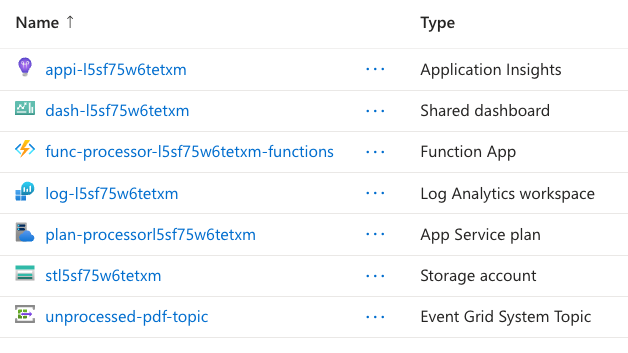
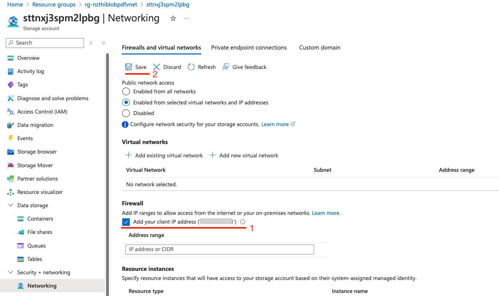
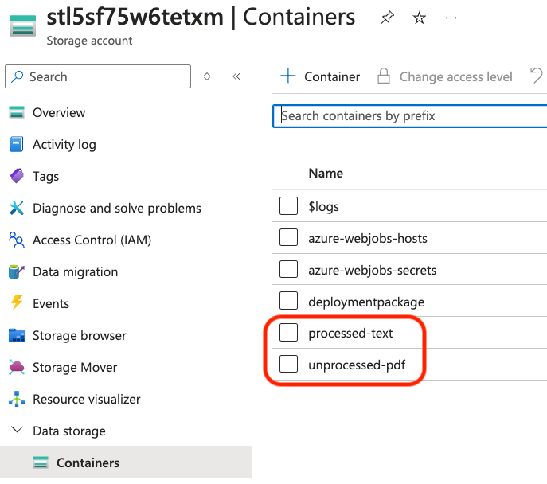
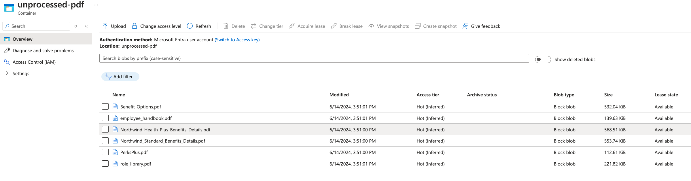
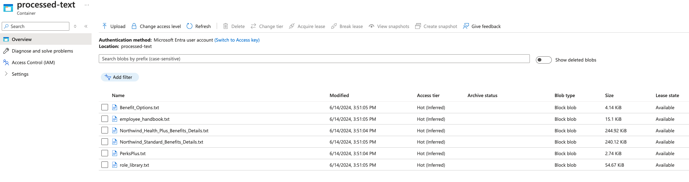

# Flex Consumption plan - PDF to text processor | Azure Functions

Processing binary files from Azure Blob Storage is a key scenario for Azure Functions. This end-to-end JavaScript sample showcases an event-based Blob storage triggered function that converts PDF documents to text at scale. It also uses managed identity and a virtual network between the function app and storage account for security best practices.

This solution creates two containers in blob storage, `unprocessed-pdf` and `processed-text`. An Event Grid-based Blob storage triggered function written in JavaScript is executed when a PDF file is added to the `unprocessed-pdf` container, converts the PDF to text using the [PDF.js](https://www.npmjs.com/package/pdfjs-dist) library, and saves the text to the `processed-text` container.

Using an Event Grid-based Blob storage trigger reduces latency by triggering your function instantly as changes occur in the container. This type of Blob storage trigger is the only type of Blob storage trigger that can be used when running in a Flex Consumption plan.

The communication between the function and the storage account happens via a system assigned managed identity, and the storage account is restricted behind a virtual network. The Azure Function uses [VNet integration](https://learn.microsoft.com/azure/azure-functions/functions-networking-options?tabs=azure-portal#virtual-network-integration) to reach the storage account. You can opt out of a VNet being used in the sample by setting SKIP_VNET to true in the parameters.


> [!IMPORTANT]
> This sample creates several resources. Make sure to delete the resource group after testing to minimize charges!

## Prerequisites

Before you can run this sample, you must have the following:

* An Azure subscription
* Ensure both Microsoft.Web and Microsoft.App are [registered resource providers on the Azure subscription](https://learn.microsoft.com/azure/azure-resource-manager/management/resource-providers-and-types#register-resource-provider)
* [Azure CLI](https://learn.microsoft.com/cli/azure/install-azure-cli)
* [Azure Dev CLI](https://learn.microsoft.com/azure/developer/azure-developer-cli/install-azd?tabs=winget-windows%2Cbrew-mac%2Cscript-linux&pivots=os-windows)

## Provision the solution on Azure

To set up this sample, follow these steps:

1. Clone this repository to your local machine.
2. in the root folder use the [Azure Developer CLI (azd)](https://learn.microsoft.com/azure/developer/azure-developer-cli/install-azd?tabs=winget-windows%2Cbrew-mac%2Cscript-linux&pivots=os-windows) to provision a new resource group with all the resources for the sample using the the environment name you and in the location you provide.

```bash
azd up
```

Alternatively, you can opt-out of a VNet being used in the sample. To do so, use `azd env` to configure `SKIP_VNET` to `true` before running `azd up`:

```bash
azd env set SKIP_VNET true
azd up
```

## Inspect the solution (optional)

1. Once the deployment is done, inspect the new resource group. The Flex Consumption function app and plan, storage, and App Insights have been created and configured:

1. By default the storage account will be locked to the virtual network. To be able to access the containers using the Azure Portal, you can add your client IP Address to the storage account Firewall. In the Azure Portal open the storage account created by the sample, go to `Networking` in the `Security + networking` section, and add your client IP address to the Firewall. After a minute you will be able to browse to the data storage containers. This step is not required if you turned off the VNet creation.

1. The storage account has two extra containers in blob storage:

1. Open the `processed-text` and `unprocessed-pdf` containers, which are empty.

## Test the solution

1. Using the Azure Portal or any other tool, upload PDF files to the `unprocessed-pdf` container. There are sample PDF files in the local [data folder](./data). For example, once all files in data folder are uploaded to the `unprocessed-pdf` container you should see:

1. Browse to the `processed-text` folder and notice that within seconds all the uploaded PDF files have now been processed into text files by the Flex Consumption hosted function:


## Clean up resources

When you no longer need the resources created in this sample, run the following command to delete the Azure resources:

```bash
azd down
```

## Resources

For more information on Azure Functions, Event Hubs, and VNet integration, see the following resources:

- [Azure Functions Flex Consumption documentation](https://learn.microsoft.com/azure/azure-functions/flex-consumption-plan)
- [Tutorial: Trigger Azure Functions on blob containers using an event subscription](https://learn.microsoft.com/azure/azure-functions/functions-event-grid-blob-trigger)
