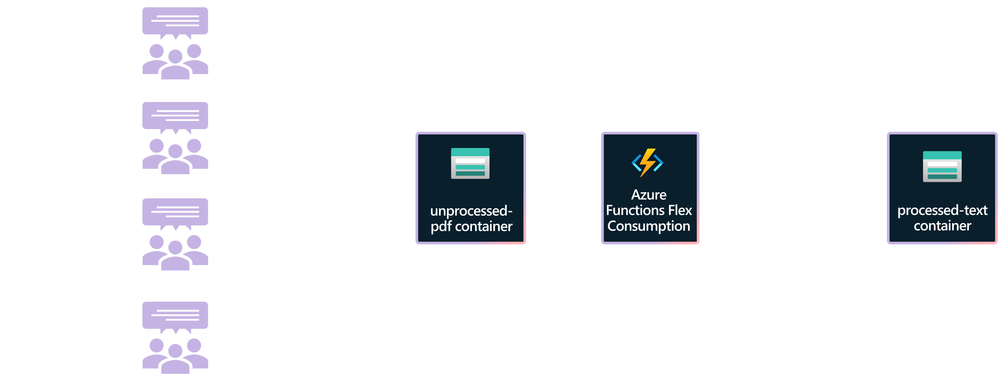

# Flex Consumption plan - PDF to text processor | Azure Functions

Processing binary files from Azure Blob Storage is a key scenario for Azure Functions. This end-to-end JavaScript sample showcases an event-based Blob storage triggered function that converts PDF documents to text at scale.

This solution creates two containers in blob storage, `unprocessed-pdf` and `processed-text`. An Event Grid-based Blob storage triggered function written in JavaScript is executed when a PDF file is added to the `unprocessed-pdf` container, converts the PDF to text using the [PDF.js](https://www.npmjs.com/package/pdfjs-dist) library, and saves the text to the `processed-text` container.

Using an Event Grid-based Blob storage trigger reduces latency by triggering your function instantly as changes occur in the container. This type of Blob storage trigger is the only type of Blob storage trigger that can be used when running in a Flex Consumption plan.



> [!IMPORTANT]
> This sample creates several resources. Make sure to delete the resource group after testing to minimize charges!

## Prerequisites

Before you can run this sample, you must have the following:

- An Azure subscription
- [Azure CLI](https://learn.microsoft.com/cli/azure/install-azure-cli)
- [Azure Functions Core Tools](https://learn.microsoft.com/azure/azure-functions/functions-run-local?tabs=v4%2Clinux%2Ccsharp%2Cportal%2Cbash#install-the-azure-functions-core-tools)
- [Azure Dev CLI](https://learn.microsoft.com/azure/developer/azure-developer-cli/install-azd?tabs=winget-windows%2Cbrew-mac%2Cscript-linux&pivots=os-windows)

## Provision the solution on Azure

To set up this sample, follow these steps:

1. Clone this repository to your local machine.
2. in the root folder use the [Azure Developer CLI (azd)](https://learn.microsoft.com/azure/developer/azure-developer-cli/install-azd?tabs=winget-windows%2Cbrew-mac%2Cscript-linux&pivots=os-windows) to provision a new resource group with the environment name you provide and all the resources for the sample.

```bash
azd up
```

## Inspect the solution (optional)

1. Once the deployment is done, inspect the new resource group. The Flex Consumption function app and plan, storage, and App Insightshave been created and configured:


2. The storage account has two extra containers in blob storage:


3. Open the `processed-text` and `unprocessed-pdf` containers, which are empty. 

## Test the solution

1. Using the Azure Portal or any other tool, upload PDF files to the `unprocessed-pdf` container. There are sample PDF files in the local [data folder](./data). For example, once all files in data folder are uploaded to the `unprocessed-pdf` container you should see:

2. Browse to the `processed-text` folder and noticed that all the uploaded PDF files have now been processed into text files by the Flex Consumption hosted function:
 

## Clean up resources

When you no longer need the resources created in this sample, run the following command to delete the Azure resources:

```bash
azd down
```

## Resources

For more information on Azure Functions, Event Hubs, and VNet integration, see the following resources:

* [Azure Functions Flex Consumption documentation](https://learn.microsoft.com/azure/azure-functions/flex-consumption-plan)
* [Tutorial: Trigger Azure Functions on blob containers using an event subscription](https://learn.microsoft.com/azure/azure-functions/functions-event-grid-blob-trigger)
