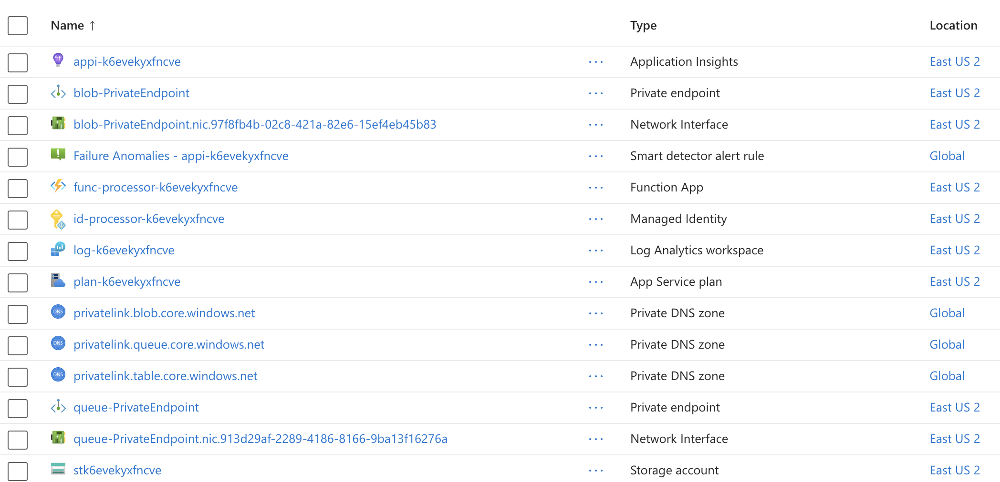

# Flex Consumption plan - Order processing workflow | Azure Durable Functions

Durable Functions helps you easily orchestrate stateful logic with *imperative* code, making it an excellent solution for workflow scenarios, as well as stateful patterns like fan-out/fan-in and workloads that require long-running operations or need to wait arbitrarily long for external events. 

This sample shows how to implement an order processing workflow with Durable Functions in C# (running in the isolated model) and can easily be deployed to a function app in Azure. Durable Functions needs a ["storage backend provider"](https://learn.microsoft.com/azure/azure-functions/durable/durable-functions-storage-providers) to persist application states. This sample uses the default backend, which is Azure Storage.  

> [!IMPORTANT]
> This sample creates several resources. Make sure to delete the resource group after testing to minimize charges!

## Run in your local environment

The project is designed to run on your local computer, provided you have met the [required prerequisites](#prerequisites). You can run the project locally in these environments:

+ [Using Azure Functions Core Tools (CLI)](#using-azure-functions-core-tools-cli)
+ [Using Visual Studio](#using-visual-studio)
+ [Using Visual Studio Code](#using-visual-studio-code)

### Prerequisites

+ [.NET 8 SDK](https://dotnet.microsoft.com/download/dotnet/8.0) 
+ [Azure Functions Core Tools](https://learn.microsoft.com/azure/azure-functions/functions-run-local?tabs=v4%2Cmacos%2Ccsharp%2Cportal%2Cbash#install-the-azure-functions-core-tools)
+ Start Azurite storage emulator. See [this page](https://learn.microsoft.com/azure/storage/common/storage-use-azurite) for how to configure and start the Azurite emulator for Local Storage.
+ Create a file named `local.settings.json` in **OrderProcessor** directory and add the following:

  ```json
  {
    "IsEncrypted": false,
    "Values": {
      "AzureWebJobsStorage": "UseDevelopmentStorage=true",
      "FUNCTIONS_WORKER_RUNTIME": "dotnet-isolated"
    }
  }
  ```

### Using Azure Functions Core Tools (CLI)

1) Open a new terminal and do the following:

```bash
cd OrderProcessor
func start
```

2) This sample uses an HTTP trigger to start an orchestration, so open a browser and go to http://localhost:7071/api/OrderProcessingOrchestration_HttpStart. You should see something similar to the following: 

```json
{
    "id": "e838bdb52db24560a6b30c261ac2985d",
    "purgeHistoryDeleteUri": "http://localhost:7071/runtime/webhooks/durabletask/instances/e838bdb52db24560a6b30c261ac2985d?code=<code>",
    "sendEventPostUri": "http://localhost:7071/runtime/webhooks/durabletask/instances/e838bdb52db24560a6b30c261ac2985d/raiseEvent/{eventName}?code=<code>",
    "statusQueryGetUri": "http://localhost:7071/runtime/webhooks/durabletask/instances/e838bdb52db24560a6b30c261ac2985d?code=<code>",
    "terminatePostUri": "http://localhost:7071/runtime/webhooks/durabletask/instances/e838bdb52db24560a6b30c261ac2985d/terminate?reason={{text}}}&code=<code>"
}
```

3) To check the status of the orchestration instance started, go to the `statusQueryGetUri`. Your orchestration instance should show status "Running". After a few seconds, refresh to see that the orchestration instance is "Completed" and what the output is.

```json
{
    "name": "OrderProcessingOrchestration",
    "instanceId": "e838bdb52db24560a6b30c261ac2985d",
    "runtimeStatus": "Completed",
    "input": {
        "Name": "milk",
        "TotalCost": 5,
        "Quantity": 1
    },
    "customStatus": null,
    "output": {
        "Processed": true
    },
    "createdTime": "2024-09-12T00:29:07Z",
    "lastUpdatedTime": "2024-09-12T00:29:31Z"
}
```

### Using Visual Studio

1) Open project using Visual Studio 2022 or later.
2) Press Run/F5 to run in the debugger
3) Use same approach above to start an orchestration instance and check its status. 

### Using Visual Studio Code

1) Open this folder in a new terminal
2) Open VS Code by entering `code .` in the terminal
3) Press Run/Debug (F5) to run in the debugger
4) Use same approach above to start an orchestration instance and check its status. 


## Provision the solution on Azure

To set up this sample, follow these steps:

1. Clone this repository to your local machine.
2. in the root folder (DURABLE-FUNC-ORDER-PROCESSING) use the [Azure Developer CLI (azd)](https://learn.microsoft.com/azure/developer/azure-developer-cli/install-azd?tabs=winget-windows%2Cbrew-mac%2Cscript-linux&pivots=os-windows) to provision a new resource group with the environment name you provide and all the resources for the sample.

```bash
azd up
``` 

## Inspect the solution (optional)

Once the deployment is done, inspect the new resource group. The Flex Consumption function app and plan, storage, App Insights, and networking related resources have been created and configured:


Because Durable Functions requires access to Azure Storage Blob, Table, and Queue, we created the associated networking resources such as private endpoints, link, etc. for each of those. 

Flex Consumption has an *[always ready](https://learn.microsoft.com/azure/azure-functions/flex-consumption-how-to?#set-always-ready-instance-counts)* feature that allows users to specify the number of compute instances that are always running to minimize cold start. We [set always ready instance to 1](https://learn.microsoft.com/azure/azure-functions/flex-consumption-plan#considerations) for the "durable" group in this sample. 

The property `[maxQueuePollingInterval](https://learn.microsoft.com/azure/azure-functions/durable/durable-functions-bindings#hostjson-settings)` is also set to 1 second to decrease message processing latencies. Note, however, that lower values of `maxQueuePollingInterval` can result in higher storage costs because of increased storage transactions.

## Test the solution

1. Use this Function CLI command to quickly find the function app url:

    ```bash
    func azure functionapp list-functions <APP_NAME> --show-keys
    ````
    
    The url should look something like this: https://func-processor-abcdefgxzy.azurewebsites.net/api/OrderProcessingOrchestration_HttpStart. 

2. Open up a browser and go that url to trigger the start of an orchestration instance. 

3. Go to the `statusQueryGetUri` to see the status of your orchestration instance. It should show "Running" at the beginning, but change to "Completed" after a few seconds if you refresh the page, just like shown (above)[#using-azure-functions-core-tools-(cli)]. 

## Clean up resources

When you no longer need the resources created in this sample, run the following command to delete the Azure resources:

```bash
azd down
```

## Resources

For more information on Durable Functions, the new Flex Consumption plan, and VNet integration, see the following resources:

* [Durable Functions](https://learn.microsoft.com/azure/azure-functions/durable/durable-functions-overview)
* [Azure Functions Flex Consumption documentation](https://learn.microsoft.com/azure/azure-functions/flex-consumption-plan)