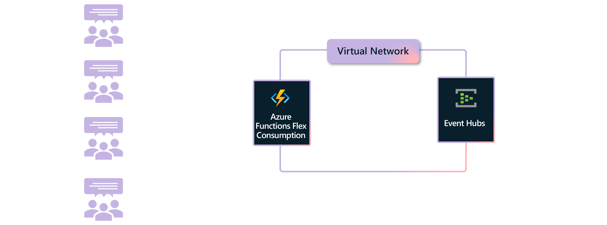
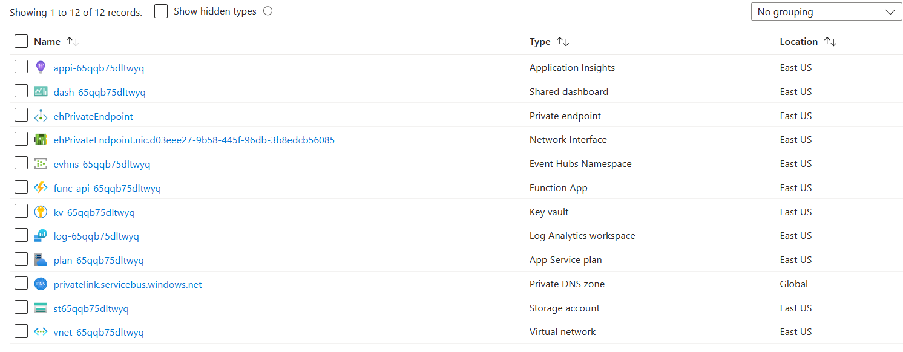
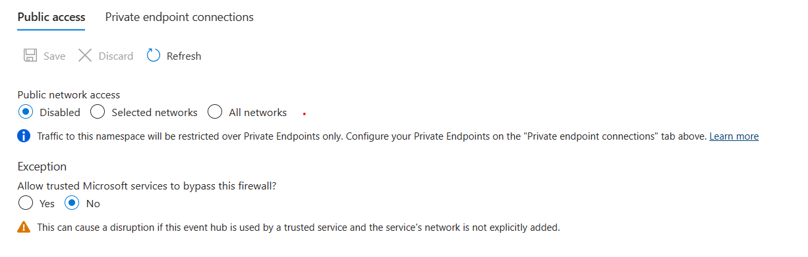
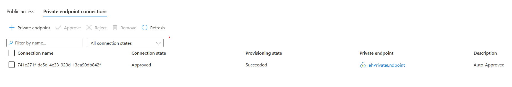
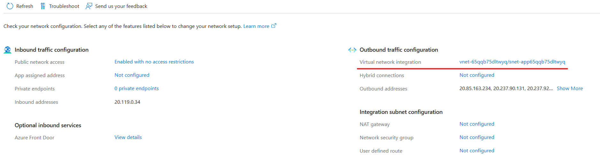
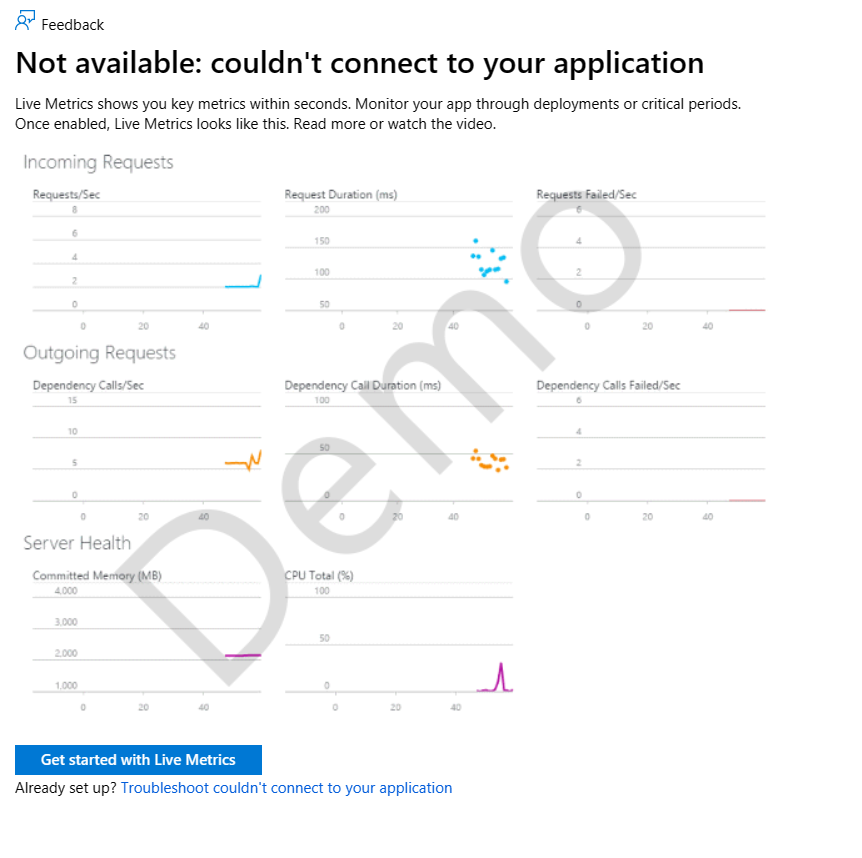
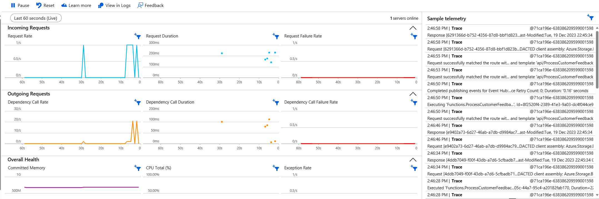
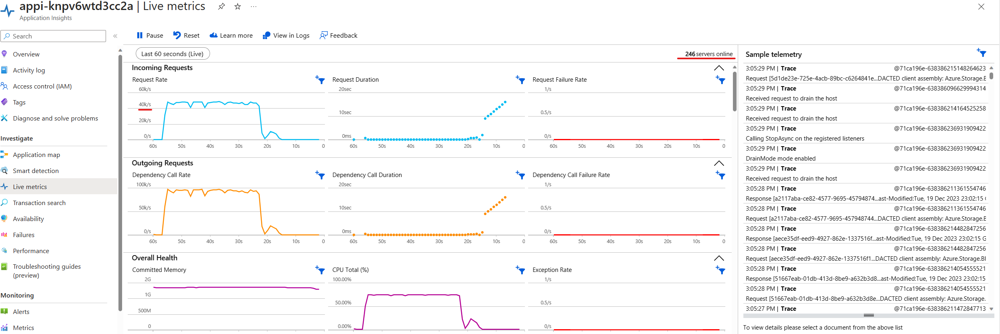

# Flex Consumption plan - HTTP trigger to Event Hubs using VNET Integration | Azure Functions

A common scenario for Azure Functions is the ingestion and processing of HTTP-based inputs. For example, an HTTP endpoint that is part of a larger API for ingesting customer feedabck and support information, or a flash sale that needs to ingest customer sign ups interested in the sale. The function app can do some validation and transformation of the provided information before sending it to a secure endpoint for further downstream processing.

This sample demonstrates a function app running in a Flex Consumption plan that connects to Event Hubs running in a virtual network. This sample demonstrates these two key features of the Flex Consumption plan:

* **High scale**. Once deployed you can run load tests against the app to see how it handles thousands of requests per second.
* **Virtual network Integration**. The Event Hubs instance to which the app sends events is secured behind a private endpoint. The function app can send events to it because it is configured to use virtual network integration.



> [!IMPORTANT]
> This sample creates several resources, includin an Event Hubs Standard namespace that is maxed-out with 40 througput units. Make sure to delete the resource group after testing to minimize charges.

## Prerequisites

Before you can run this sample, you must have the following:

* An Azure subscription
* [Azure CLI](https://learn.microsoft.com/cli/azure/install-azure-cli)
* [Azure Functions Core Tools](https://learn.microsoft.com/azure/azure-functions/functions-run-local#install-the-azure-functions-core-tools)
* [Azure Dev CLI](https://learn.microsoft.com/azure/developer/azure-developer-cli/install-azd)

## Provision the solution on Azure

To set up this sample, follow these steps:

1. Clone this repository to your local machine.
2. in the root folder use [Azure Developer CLI (azd)](https://learn.microsoft.com/azure/developer/azure-developer-cli/install-azd) to provision a new resource group with the environment name you provide and all the resources for the sample.

```bash
azd up
```

## Inspect the solution (optional)

1. Once the deployment is done, inspect the new resource group. The Flex Consumption function app and plan, storage, App Insights, Event Hubs, and networking services have been created and configured:

2. The Event Hubs namespace public network access has been turned off so nothing outside the VNet can access Event Hubs. You can check this in the Event Hub Namespace's `Networking` tab and the `Public access` tab:

3. The Event Hubs namespace has a private endpoint configured to one of the subnets in the Vnet. This means it can only be accessed from inside the VNet. You can check this in the Event Hub Namespace's `Networking` tab and the `Private Endpoint connections`:

4. An outbound virtual network integration has been created in your Function App into another subnet in the same VNet. This means it can access the Event Hubs namespace. You can check this in the function app's `Networking` tab in the `Outbound traffic configuration` section:

5. Open the Application Insights instance that was created by the Bicep deploy. Open the `Live metrics` tab to monitor for live events. Notice that it can't connect to the application. This is expected, because the Flex Consupmtion app is scaled to zero as there's no traffic or executions happening yet.


## Test the solution

1. Use a REST client to make HTTP POST calls to the function URL provided by the deployment output. If using VS Code, you can install and use the REST Client extension and use the [test.http](./loadtest/test.http) file. The `loadtest` folder also has sample JSON files you to use in the testing.
2. Refresh the Application Insights live metrics, and observe the telemetry and how now it shows successful executions. This means your HTTP calls are making their way through the function app and into you VNet secured Event Hubs instance.

3. Create a load test against your app using your favorite load testing solution. If you use Azure Load Testing or JMeter, you can use the example [loadtest.jmx](./loadtest/httppost.jmx) in your tests, making sure to edit the function name throughput the file.
4. Run a load test and observe from your load testing solution, or from Application Insights live metrics, how the solution can scale very fast to handle thousands of requests per second, through Flex Consumption and into Event Hubs via the Vnet.


## Clean up resources

When you no longer need the resources created in this sample, run the following command to delete the Azure resources:

```bash
azd down
```

## Resources

For more information on Azure Functions, Event Hubs, and VNet integration, see the following resources:

* [Azure Functions documentation](https://docs.microsoft.com/azure/azure-functions/)
* [Azure Event Hubs documentation](https://docs.microsoft.com/azure/event-hubs/)
* [Azure Virtual Network documentation](https://docs.microsoft.com/azure/virtual-network/)
