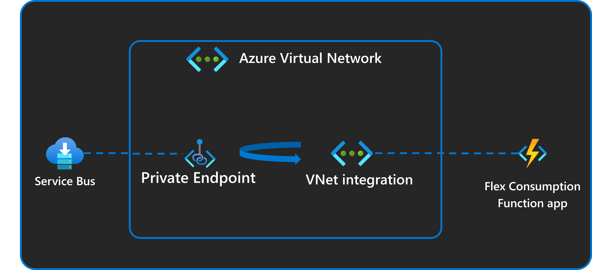
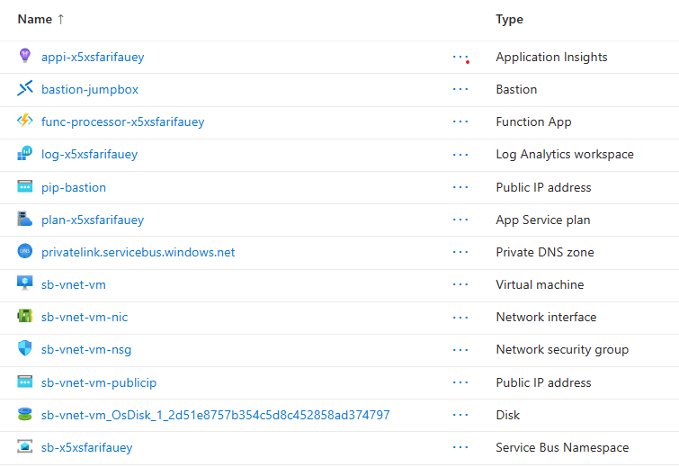
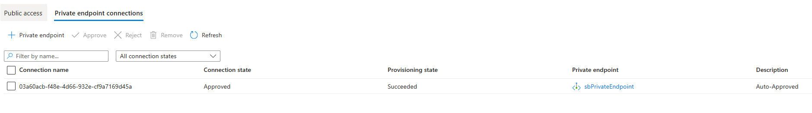
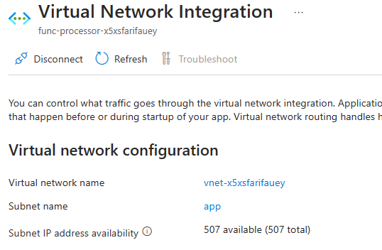
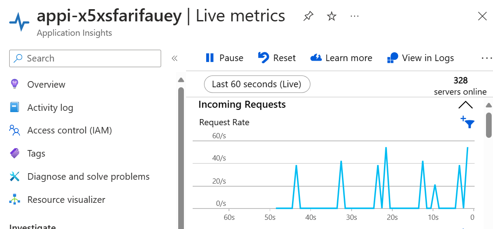

# Flex Consumption plan - Service Bus trigger using virtual network integration | Azure Functions

A common scenario that Azure Functions can be used for is for the processing of queue based events. For example, a list of batch processing jobs is queued up with instructions for machine learning processing. The function app can do some ML inferencing before completing the message in the queue.

This sample demonstrates a function app running in a Flex Consumption plan that connects to Service Bus running in a virtual network. This sample demonstrates these two key features of the Flex Consumption plan:

* **High scale**. A low concurency of 1 is configured for the function app in the `host.json` file. Once messages are loaded into Service Bus and the app is started, you can see how it scales to one app instance per message simultaneously.
* **Virtual newtork integration**. The Service Bus that this Flex Consumption app reads events from is secured behind a private endpoint. The function app can read events from it because it is configured with VNet integration. All connections to Service Bus and to the storage account associated with the Flex Consumption app also use managed identity connections instead of connection strings.



> [!IMPORTANT]
> This sample creates several resources. Make sure to delete the resource group after testing to minimize charges!

## Prerequisites

Before you can run this sample, you must have the following:

* An Azure subscription
* [Azure CLI](https://learn.microsoft.com/cli/azure/install-azure-cli) or [PowerShell Az Module](https://learn.microsoft.com/powershell/azure/new-azureps-module-az)
* [Azure Functions Core Tools](https://learn.microsoft.com/azure/azure-functions/functions-run-local?tabs=v4%2Clinux%2Ccsharp%2Cportal%2Cbash#install-the-azure-functions-core-tools)
* [Azure Dev CLI](https://learn.microsoft.com/azure/developer/azure-developer-cli/install-azd?tabs=winget-windows%2Cbrew-mac%2Cscript-linux&pivots=os-windows)


## Provision the solution on Azure

To set up this sample, follow these steps:

1. Clone this repository to your local machine.
2. Sign in to Azure Developer CLI with the following command:

  ```bash
  azd auth login
  ```

3. Sign in to either the Azure CLI or PowerShell (with Az module) to provide authentication for the hooks.

  Azure CLI authentication in bash terminal:
  
  ```bash
  az login
  ```

  PowerShell authentication in PowerShell terminal:

  ```powershell
  Connect-AzAccount
  ```

4. Move into the `SB-VNET` folder using the following command:

  ```bash
  cd E2E/SB-VNET
  ```

5. Use [Azure Dev CLI](https://learn.microsoft.com/azure/developer/azure-developer-cli/install-azd?tabs=winget-windows%2Cbrew-mac%2Cscript-linux&pivots=os-windows) to provision a new resource group with the environment name you provide and all the resources for the sample, then publish the code to the function app. It will also ask you for a password to be used for the Virtual Machine.

  ```bash
  azd up
  ```

## Inspect the solution (optional)

1. Once the deployment is done, inspect the new resource group. The Flex Consumption function app and plan, storage, App Insights, Service Bus, and networking services have been created and configured:

1. The Service Bus namespace public network access has been turned off so nothing outside the VNet can access Service Bus. You can check this in the Service Bus  Namespace's `Networking` tab and the `Public access` tab:

1. The Service Bus namespace has a private endpoint configured to one of the subnets in the VNet. This means it can only be accessed from inside the VNet. You can check this in the Service Bus Namespace's `Networking` tab and the `Private Endpoint connections`:

1. An outbound virtual network integration has been created in your Function App into another subnet in the same VNet. This means it can access the Service Bus namespace. You can check this in the function app's `Networking` tab in the `Outbound traffic configuration` section:

1. Open the Application Insights instance that was created by the Bicep deploy. Open the `Live metrics` tab to monitor for live events. Notice that it can't connect to the application, or shows only one 'server' online. This is expected, because the Flex Consupmtion app is scaled to down as there's no traffic or executions happening yet.
1. A virtual machine and bastion were configured on the same VNet so you can access service bus from it. The user name is `sb-vnet-vm-user` and the password is the one you provided when provisioning the environment. You can optionally use this VM to test sending messages to Service Bus from inside the VNet. Or you can add your own machine's IP address to [the Service Bus networking configurations](https://learn.microsoft.com/azure/service-bus-messaging/service-bus-ip-filtering) and send messages to service bus from your own machine. 
1. Inspect [the host.json file](./src/host.json) and notice that Service Bus' `maxConcurrentCalls` has been set to 1. This makes the per instance concurrency be 1 so your function will scale to multiple instances to handle messages put in the Service Bus queue.
1. Inspect the [function_app.py](./src/function_app.py) and notice there is a delay of 30 seconds in the code, to simulate that the each message would take 30 seconds to complete being processed.

## Test the solution

1. In the Azure portal remote into the VM using bastion. The user name is `sb-vnet-vm-user` and the password is the one you provided when provisioning the environment.
1. Install [Service Bus explorer](https://github.com/paolosalvatori/ServiceBusExplorer/releases) on the VM, and use it to connect to your service bus instance and send messages to the queue. For example, use the sender in Service Bus Explorer to send 1,000 messages.
1. Open Application Insights live metrics and notice the number of instances ('servers online'). Notice your app scaling the number of instances to handle processing the messages. Given there is a purpuseful [30 second delay in the app code](./src/function_app.py#L12) you should see the messages being processed in 30 seconds intervals once the the app's maximum instance count (default of 100) is reached. The sample telemetry should also show that your messages are triggering the function, and making their way from Service Bus through the VNet into the function app for processing.


## Clean up resources

When you no longer need the resources created in this sample, run the following command to delete the Azure resources:

```bash
azd down
```

## Resources

For more information on Azure Functions, Service Bus, and VNet integration, see the following resources:

* [Azure Functions documentation](https://docs.microsoft.com/azure/azure-functions/)
* [Azure Service Bus documentation](https://docs.microsoft.com/azure/service-bus/)
* [Azure Virtual Network documentation](https://docs.microsoft.com/azure/virtual-network/)
