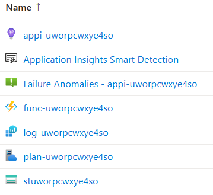

# Flex Consumption plan - Bicep sample | Azure Functions

This bicep sample deploys sample deploys a function app and other required resources in a Flex Consumption plan. When used in a Bicep-based deployment, this Bicep file creates these Azure components:

| Component | Description |
| ---- | ---- |
| **Function app** | This is the serverless Flex Consumption app where you can deploy your functions code. The function app is configured with Application Insights and Storage Account.|
| **Function app plan** | The Azure Functions app plan associated with your Flex Consumption app. For Flex Consumption there is only one app allowed per plan, but the plan is still created.|
| **Application Insights** | This is the telemetry service associated with the Flex Consumption app for you to monitor live applications, detect performance anomalies, review telemetry logs, and to understand your app behavior.|
| **Log Analytics Workspace** | This is the workspace used by Application Insights for the app telemetry.|
| **Storage Account** | This is the Microsoft Azure storage account that [Azure Functions requires](https://learn.microsoft.com/azure/azure-functions/storage-considerations) when you create a function app instance.|

## How to deploy it?

Use these steps to deploy using the Bicep file.

### 1. Modify the parameters file

Create a copy and modify the parameters file `main.bicepparam` to specify the values for the parameters. The parameters file contains the following parameters that you must specify values for before you can deploy the app:

| Parameter | Description |
| ---- | ---- |
| **environmentName** | a unique name to be used for the resources being created.|
| **location** | the location where the assets will be created. You can find the supported regions with the `az functionapp list-flexconsumption-locations` command of the Azure CLI.|

Here is an example `main.bicepparam` that you can modify:

```bicep
using 'main.bicep'
param environmentName = 'myflexconsumptionapp'
param location = 'eastasia'
```

### 2. Deploy the bicep file

Before you can deploy this app, you need a way to deploy Bicep files. For example, you can use [Visual Studio Code with the Bicep extension](https://learn.microsoft.com/azure/azure-resource-manager/bicep/deploy-vscode), the [Azure CLI](https://learn.microsoft.com/azure/azure-resource-manager/bicep/deploy-cli) (make sure you have the latest version of the Bicep CLI installed by running `az bicep upgrade`), or [PowerShell](https://learn.microsoft.com/azure/azure-resource-manager/bicep/deploy-powershell).

For example, if you created a `maincopy.bicepparam` file with the above parameter values, you can deploy the app by running the following command, making sure to modify the value for location with the same location as in your updated copy of `main.bicepparam`:

```bash
az deployment sub create --name fcthibicep1 --location eastus --template-file main.bicep --parameters maincopy.bicepparam
```

Once deployed you should see the services created on Azure:


You can now use Azure Functions Core Tools, VS Code, or the Azure CLI to create and publish your app code to the function app. 
