<!--
title: "Azure Functions Migration: Linux Consumption to Flex Consumption Guide"
description: "Learn how to migrate Azure function apps from Linux Consumption to Flex Consumption with step-by-step instructions, AZ CLI commands, and best practices for CI/CD and infrastructure updates."
author: nzthiago
ms.author: thalme
ms.service: Azure Functions
ms.topic: upgrade-and-migration-article
ms.date: 04/25/2025

#customer intent: As a developer, I want to migrate my Azure function apps to Flex Consumption so that I can leverage improved scalability, performance, and networking security.
-->
# Migrate from Azure Functions Linux Consumption to Flex Consumption - this is a draft of the guide still under review

This article provides step-by-step instructions for migrating Azure function apps from the Linux Consumption plan to the Flex Consumption plan. It is intended for developers and administrators looking to modernize their function apps to take advantage of the benefits offered by the Flex Consumption plan.

## Table of Contents
- [Prerequisites](#prerequisites)
- [Methods](#methods)
- [Assessment - Identify a Function App Running on Linux Consumption](#assessment---identify-a-function-app-running-on-linux-consumption)
- [Assessment - Verify Region Compatibility](#assessment---verify-region-compatibility)
- [Assessment - Verify Runtime Compatibility](#assessment---verify-runtime-compatibility)
- [Assessment - Verify Runtime Stack Version Compatibility](#assessment---verify-runtime-stack-version-compatibility)
- [Assessment - Verify Deployment Slots Usage](#assessment---verify-deployment-slots-usage)
- [Assessment - Verify Use of Certificates](#assessment---verify-use-of-certificates)
- [Assessment - Verify Use of Blob Trigger](#assessment---verify-use-of-blob-trigger)
- [Pre-migration Tasks - App Settings](#pre-migration-tasks---app-settings)
- [Pre-migration Tasks - App Configuration](#pre-migration-tasks---app-configuration)
- [Pre-migration Tasks - Identity Based Role Access](#pre-migration-tasks---identity-based-role-access)
- [Pre-migration Tasks - Built-in Authentication, App and Function Keys](#pre-migration-tasks---built-in-authentication-app-and-function-keys)
- [Pre-migration Tasks - Networking Access Restrictions](#pre-migration-tasks---networking-access-restrictions)
- [Pre-migration Tasks - App Code or Zip File](#pre-migration-tasks---app-code-or-zip-file)
- [Migration Steps](#migration-steps)
- [Validation](#validation)
- [Troubleshooting and Recovery Strategies](#recovery-strategies)
- [Post-migration Tasks](#post-migration-tasks)
- [What to Expect After Migration](#what-to-expect-after-migration)

The Flex Consumption plan provides several advantages over the Linux Consumption plan, including:

- **Improved scalability**: Handle higher workloads with enhanced dynamic scaling capabilities.
- **Enhanced performance**: Benefit from low cold start times and optimized resource allocation.
- **Networking security**: Leverage Virtual Network (VNet) integration and private endpoints.

For further benefits and comparisons between Linux Consumption and Flex Consumption see [Benefits](https://learn.microsoft.com/en-us/azure/azure-functions/flex-consumption-plan#benefits). 

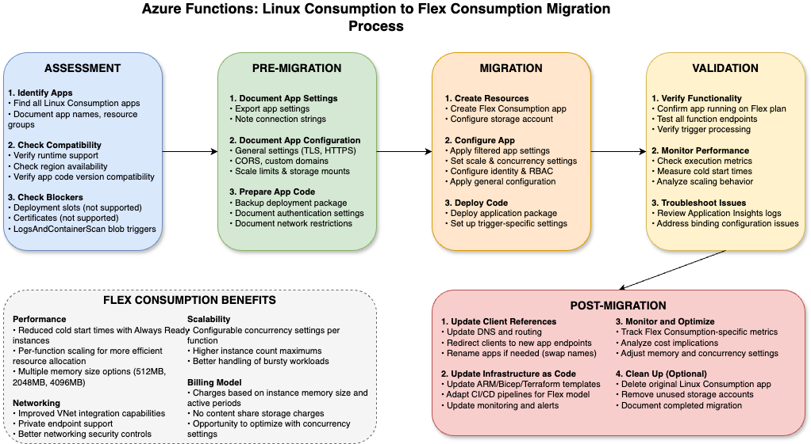
*Image Description*: This diagram illustrates the complete migration journey from Linux Consumption to Flex Consumption. It shows the three main phases: Assessment (compatibility checks, pre-migration preparation), Migration (creating the new Flex Consumption app, configuring settings, and deploying code), and Post-Migration (validation, monitoring, and cleanup). Each box represents a key step in the process as detailed in this guide.

## Methods

You have three options for migrating your Azure Function App from Linux Consumption to Flex Consumption:

1.  **Manual migration using Azure CLI or the Azure Portal**:
    - Continue reading this guide for detailed step-by-step instructions with Azure CLI commands or the Azure Portal
    - This approach gives you full control over each step of the migration process

2.  **Guided migration using the provided shell script**:
    - For a more interactive experience that guides you through each step of the migration process, use the provided shell script
    - To use the shell script:
      ```bash
      # Make the script executable
      chmod +x migration-guide.sh
      
      # Run the script
      ./migration-guide.sh
      ```
    - The script will prompt you for inputs when needed and perform each step of the migration process

3.  **Guided migration using the provided PowerShell script**:
    - For a guided experience using PowerShell, use the provided PowerShell script
    - To use the PowerShell script:
      ```powershell
      # Ensure execution policy allows running local scripts (run as Administrator if needed)
      # Set-ExecutionPolicy RemoteSigned -Scope CurrentUser 
      
      # Run the script
      .\migration-guide.ps1
      ```
    - The script will prompt you for inputs when needed and perform each step of the migration process

Choose the method that best suits your needs and experience level. The guided scripts are recommended for those who want a step-by-step approach, while the manual method provides more flexibility and control.

## Prerequisites

### Using Azure CLI

1. Latest Azure CLI installed and authenticated (v2.71.0 or later recommended)
2. The Azure CLI [resource-graph](https://learn.microsoft.com/en-us/azure/governance/resource-graph/first-query-azurecli) extension is **required** for this migration guide. Install it using:
```bash
az extension add --name resource-graph
# Verify installation
az extension show --name resource-graph
```
3. The jq tool is highly recommended for processing JSON output. Install it using:
```bash
# For macOS
brew install jq

# For Ubuntu/Debian
sudo apt-get install jq

# Verify installation
jq --version
```
4. Access to the Azure subscription containing the function app(s) to migrate
5. Ensure the account used to run AZ CLI commands has permissions to:
   - Create and manage function apps and app service plans
   - Assign roles (if your app uses managed identities)
   - Create and manage storage accounts
   - Access all dependent resources (e.g., Key Vault, Service Bus, Event Hub)
   - Typically, an **Owner** or **Contributor** role on the resource group is sufficient

### Using Azure Portal

1. Access to the [Azure Portal](https://portal.azure.com)
2. A modern web browser (Microsoft Edge, Google Chrome, or Mozilla Firefox - latest versions recommended)
3. Ensure the account used has permissions to:
   - Create and manage function apps and app service plans
   - Assign roles (if your app uses managed identities)
   - Create and manage storage accounts
   - Access all dependent resources (e.g., Key Vault, Service Bus, Event Hub)
   - Typically, an **Owner** or **Contributor** role on the resource group is sufficient

### Technical Knowledge Requirements

To successfully complete this migration, you should have:

1. **Understanding of Azure Functions** concepts and architecture
2. **Familiarity with your function app's triggers and bindings**
3. **Knowledge of the dependencies** your functions rely on
4. **Understanding of networking configurations** if your app uses VNet integration or private endpoints
5. **Basic troubleshooting skills** to address any issues that may arise during migration

### Required Documentation and Resources

For both methods, we recommend reviewing the [Azure Functions Flex Consumption documentation](https://learn.microsoft.com/en-us/azure/azure-functions/flex-consumption-plan) before starting:

 - [Azure Functions Flex Consumption Plan Overview](https://learn.microsoft.com/en-us/azure/azure-functions/flex-consumption-plan)
 - [How to Use the Flex Consumption Plan](https://learn.microsoft.com/en-us/azure/azure-functions/flex-consumption-how-to)
 - [Azure Functions Flex Consumption General Availability Announcement](https://techcommunity.microsoft.com/blog/appsonazureblog/azure-functions-flex-consumption-is-now-generally-available/4298778)
 - [Azure Functions Flex Consumption quickstart, infrastructure as code, and end-to-end samples](https://aka.ms/flexconsumption/samples)

## Assessment - Identify a function app running on Linux Consumption for the migration

### Using Azure CLI

Use the following Azure CLI command with the [resource-graph](https://learn.microsoft.com/en-us/azure/governance/resource-graph/first-query-azurecli) extension to list all function apps in your subscription that are running on the Linux Consumption plan. This command:
  1. Ensures the query is scoped to the currently selected Azure subscription from Azure CLI
  2. Filters function apps based on their kind (`functionapp,linux`)
  3. Checks if they are using the Linux Consumption plan (`Dynamic` SKU), and 
  4. Outputs a table with the app name, location, and runtime stack (runtime and version)

  ```bash
az graph query -q "resources | where subscriptionId == '$(az account show --query id -o tsv)' | where type == 'microsoft.web/sites' | where ['kind'] == 'functionapp,linux' | where properties.sku == 'Dynamic' | extend siteProperties=todynamic(properties.siteProperties.properties) | mv-expand siteProperties | where siteProperties.name=='LinuxFxVersion' | project name, location, resourceGroup, stack=siteProperties.value" --query data --output table
```

Make a list of the function apps you need to migrate, noting their names, resource groups, locations, and runtime stacks, then follow the rest of this guide for each.

### Using Azure Portal

1. Navigate to the [Azure Portal](https://portal.azure.com).
2. If you have a large number of apps you can use the [Azure Resource Graph Explorer](https://portal.azure.com/#view/HubsExtension/ArgQueryBlade) in the Azure Portal with the following query, which you can then download to a CSV file:

  ```kusto
  resources 
  | where type == 'microsoft.web/sites' 
  | where ['kind'] == 'functionapp,linux' 
  | where properties.sku == 'Dynamic'
  | extend siteProperties=todynamic(properties.siteProperties.properties) 
  | mv-expand siteProperties 
  | where siteProperties.name=='LinuxFxVersion' 
  | project name, location, resourceGroup, stack=tostring(siteProperties.value)
  ```
   
  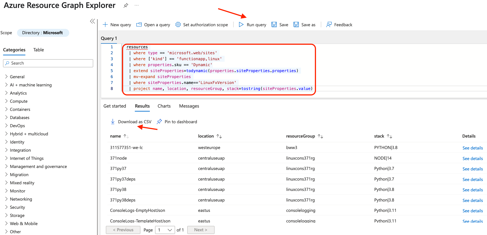  
  *Image Description*: A screenshot of the Azure Resource Graph Explorer interface, showing a query to identify Linux Consumption Function Apps in an Azure subscription.

3. Alternatively, from the Azure Portal home select "Function App" on the list of "Azure services" or use the search bar to search for "Function App".

4. In the function app list, you can identify Linux Consumption apps by:
  - Filtering the `Pricing Tier` column for `Dynamic`
  - Filtering the `Kind` column for `functionapp,linux`
  - Optionally, you can filter further by region or resource group to narrow down the list of function apps

  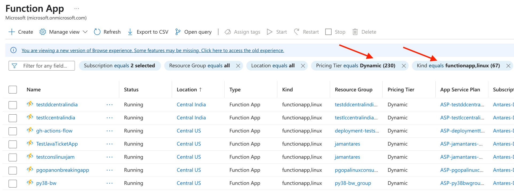
  *Image Description*: A screenshot of the Azure Portal Function App interface, showing filters to identify Linux Consumption Function Apps in an Azure subscription.

5. For each function app, click on it and check:
  - Under the "Overview" tab, look for "App Service Plan" which should show "(Y1:0)" at the end of the Plan name and "Operating System" should show "Linux"  
  - In the properties tab, take note of the "Runtime Stack" value as you will need to check it later to ensure it's supported in Flex Consumption

  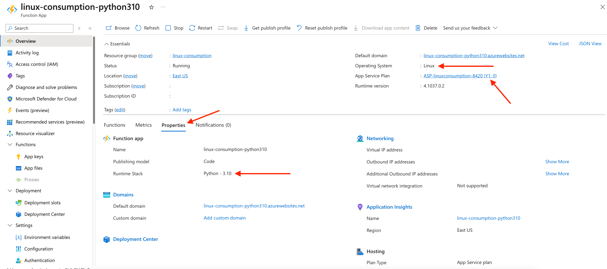
  *Image Description*: A screenshot of the Azure Portal Function App interface, showing filters to identify Linux Consumption Function Apps in an Azure subscription.

6. Make a list of the function apps you need to migrate, noting their names, resource groups, locations, and runtime stacks, then follow the rest of this guide for each.

## Assessment - Verify region compatibility

Before proceeding, verify if the Flex Consumption plan is supported in the same region as the Linux Consumption app being migrated. 

### Using Azure CLI

Use the following Azure CLI command to list all regions where Flex Consumption is available:

```bash
az functionapp list-flexconsumption-locations --query "sort_by(@, &name)[].{Region:name}" -o table
```

This command will output a table of Azure regions where the Flex Consumption plan is supported. Verify that the region of the Linux Consumption app is included in the list before continuing with the migration process. 

> **Note:** Alternatively, you can choose to migrate your Function App to a different region where the Flex Consumption plan is supported. However, be cautious of the potential latency this may introduce for the app's source and destination dependencies. Ensure that the new region provides acceptable performance for your application's requirements before proceeding.

### Using Azure Portal

  1. Navigate to the [Azure Portal](https://portal.azure.com).
  2. Click on "Create a resource" in the left-hand menu.
  3. In the search field, enter "Function App" and select it from the results.
  4. Click the "Create" button to start the Function App creation process.
  5. In the "Create Function App" form, choose "Flex Consumption" and click the "Select" button.
  6. On the "Select a Region" page, you'll see a list of regions that support the Flex Consumption plan.

  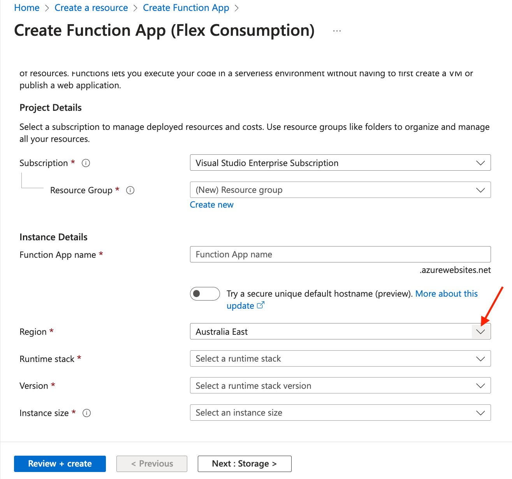
  *Image Description*: A screenshot showing the region selection dropdown during Flex Consumption function app creation.

Verify that the region of the Linux Consumption app is included in the list before continuing with the migration process. 

> **Note:** Alternatively, you can choose to migrate your Function App to a different region where the Flex Consumption plan is supported. However, be cautious of the potential latency this may introduce for the app's source and destination dependencies. Ensure that the new region provides acceptable performance for your application's requirements before proceeding.

## Assessment - Verify runtime compatibility

First, let's verify that the runtime of your app is supported by Flex Consumption:

| Runtime Stack   | Runtime Stack description  | Supported in Flex Consumption |
|-----------------|----------------------------|-------------------------------|
| dotnet-isolated | .NET isolated worker model | ✅ Yes                        |
| node            | JavaScript/TypeScript      | ✅ Yes                        |
| java            | Java                       | ✅ Yes                        |
| python          | Python                     | ✅ Yes                        |
| powershell      | PowerShell                 | ✅ Yes                        |
| dotnet          | .NET in-process model      | ❌ No                         |
| custom          | Custom handlers            | ❌ No                         |

If your function app uses an unsupported runtime stack (like .NET in-process or custom handlers), stop here. You'll need to migrate to a supported runtime stack before moving to Flex Consumption. For .NET in-process apps, [migrate to .NET isolated](https://learn.microsoft.com/en-us/azure/azure-functions/migrate-dotnet-to-isolated-model). For custom handlers, you'll need to refactor your app to use one of the supported language runtimes or migrate your app to a different hosting plan like Elastic Premium instead.

> **Important note for .NET in-process users**: If you're using the .NET in-process model (indicated by `DOTNET` in your function app's runtime stack), you must migrate to the .NET isolated model before proceeding with the Flex Consumption migration. The .NET in-process model is not supported in Flex Consumption. This requires updating your function app code to use the isolated process model. Follow the [migration guide to .NET isolated](https://learn.microsoft.com/en-us/azure/azure-functions/migrate-dotnet-to-isolated-model) to update your code before continuing with this migration process.
>
> **Note about the migration script**: If you choose to use the provided shell script (`migration-guide.sh`), it will automatically detect if your function app uses the .NET in-process model and ask you to convert it to .NET isolated first, then assumes it is a .NET isolated solution going forward. While this enables the creation of a Flex Consumption app, **you still need to update your actual function code** to use the .NET isolated programming model. The script simply handles the runtime configuration aspect.

## Assessment - Verify runtime stack version compatibility

Next, let's verify that the runtime stack version of your app is supported by Flex Consumption in this Azure region.

### Using Azure CLI

You can check if the region and runtime version are supported in Flex Consumption by using the following command. Replace <Location> with the same location as the Linux Consumption app, and <Runtime> with the runtime component of your stack (`dotnet-isolated`, `node`, `java`, `python`, `powershell`).

  ```bash
az functionapp list-flexconsumption-runtimes --location <Location> --runtime <Runtime> --query '[].{version:version}' -o tsv
```

This command will display all supported versions of your runtime stack in that location for Flex Consumption. If your current runtime version appears in the list, your app is compatible with Flex Consumption in that region.

**Example 1**: If your Linux Consumption app is in `westus2` and shows `PYTHON|3.11` for `LinuxFxVersion` in its configuration, you would use `westus2` as the location and `python` as the runtime:
      
```bash
az functionapp list-flexconsumption-runtimes --location westus2 --runtime python --query '[].{version:version}' -o tsv
```
       
  If the output includes `3.11`, then your Python 3.11 app is compatible with Flex Consumption in West US 2.

**Example 2**: If your Linux Consumption app is in `eastus` and shows `NODE|18` in its configuration, you would use `eastus` as the location and `node` as the runtime:
       
```bash
az functionapp list-flexconsumption-runtimes --location eastus --runtime node --query '[].{version:version}' -o tsv
```
      
If the output includes `20`, then your Node.js 20 app is compatible with Flex Consumption in East US.

If your function app uses an unsupported runtime stack version (like .NET 6, or Node 18), stop here. You'll need to [migrate your app code to a supported runtime stack version](https://learn.microsoft.com/en-us/azure/azure-functions/update-language-versions) before moving to Flex Consumption.

### Using Azure Portal

To verify that your app's runtime stack and version are supported in Flex Consumption using the Azure Portal:
  1. Navigate to the [Azure Portal](https://portal.azure.com)
  2. Click on `Create a resource` in the left-hand menu
  3. In the search field, enter `Function App` and select it from the results
  4. Click the `Create` button to start creating a new Function App
  5. On the `Basics` tab, choose `Flex Consumption` as the hosting plan
  6. Select the same region as your existing Linux Consumption app
  7. In the `Runtime stack` dropdown, see if your current runtime stack is available
  8. If your runtime stack is available, click on the `Version` dropdown to check if your specific version is supported

  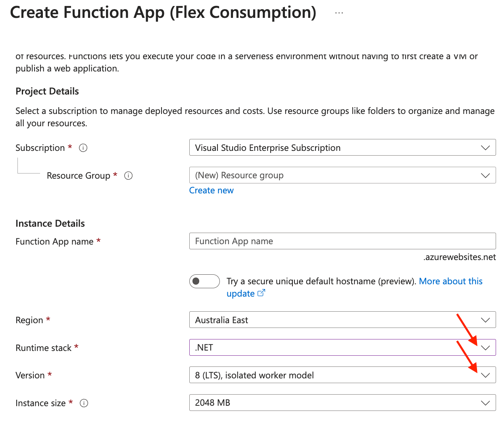
  *Image Description*: A screenshot showing the Runtime stack and Version dropdowns during Flex Consumption function app creation.

If your function app's runtime stack or version is not available in the dropdown selections, it's not compatible with Flex Consumption in that region, so stop here. You'll need to [migrate to a supported runtime stack version](https://learn.microsoft.com/en-us/azure/azure-functions/update-language-versions) by Flex Consumption before continuing.

## Assessment - Verify Deployment Slots usage

### Using Azure CLI

1. Check if the Function App is using deployment slots. Deployment slots are not supported in the Flex Consumption plan. Use the following command to list all deployment slots for a Function App:

```bash
az functionapp deployment slot list --name <FunctionAppName> --resource-group <ResourceGroupName> --output table
```

If the command returns any deployment slots, note that these are not supported in Flex Consumption. Consider consolidating the slots into the main Function App or re-architecting the application to work without slots before proceeding.

### Using Azure Portal

1. Check if the Function App is using deployment slots:
   - Navigate to your function app in the Azure Portal
   - In the left menu, find and click on "Deployment slots" under the "Deployment" section
   - If you see any slots listed in the portal, note that these are not supported in Flex Consumption. Consider consolidating the slots into the main Function App or re-architecting the application to work without slots before proceeding.
   
   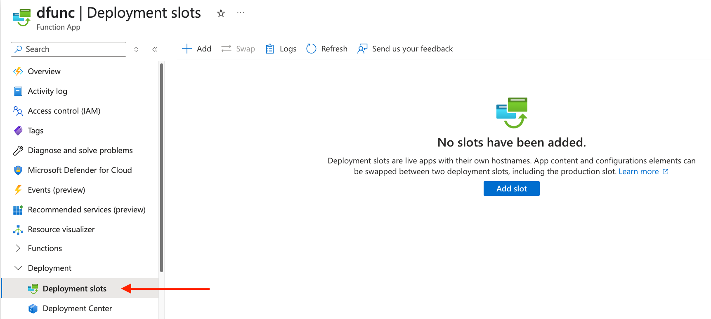

If the command returns any deployment slots, note that these are not supported in Flex Consumption. Consider re-architecting the application to work without slots before proceeding.

## Assessment - Verify use of certificates

### Using Azure CLI

3. Check if the Function App is using certificates. Certificates, such as managed certificates, bring your own certificates (BYOC), or public key certificates, will not work when migrating to the Flex Consumption plan. Use the following command to list certificates associated with the Function App's resource group:

    ```bash
    az webapp config ssl list --resource-group <ResourceGroupName> --name <FunctionAppName> 
    ```

If certificates are in use, consider waiting for certificates support in Flex Consumption before continuing as this functionality is not available in Flex Consumption.

### Using Azure Portal

1. Check if the Function App is using certificates:
   - Navigate to your function app in the Azure Portal
   - In the left menu, find and click on "Certificates" under the "Settings" section
   - Check if any certificates are configured in the Managed certificates, Bring your own certificates (.pfx), or Public key certificates (.cer) tabs

    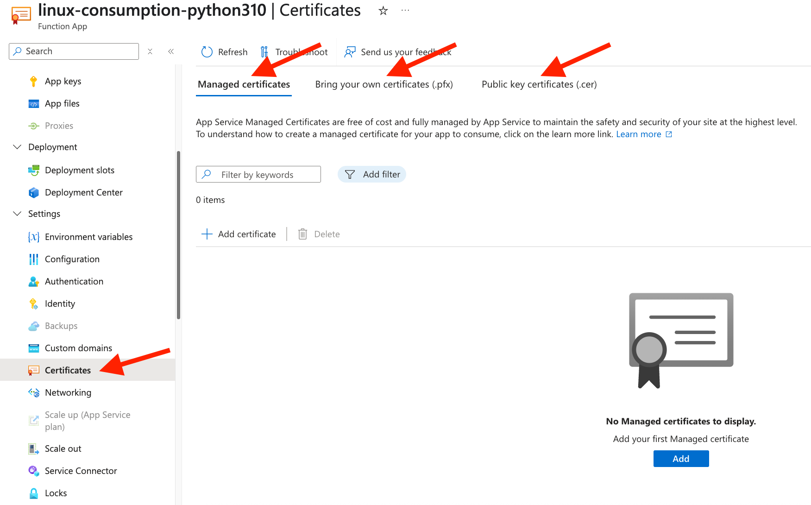
    *Image Description*: A screenshot showing the Certificates section in the Azure Portal, displaying the different certificate types that can be configured.


If certificates are in use, consider waiting for certificates support in Flex Consumption before continuing as this functionality is not available in Flex Consumption.

## Assessment - Verify use of blob trigger

Before proceeding with migration, verify if your function app uses the `LogsAndContainerScan` blob trigger source type, as this is not supported in Flex Consumption.

### Using Azure CLI

First, check if the blob trigger is used by any of the functions in the function app:

```bash
az functionapp function list --name <FunctionAppName> --resource-group <ResourceGroupName> --query "[].config.bindings[?type=='blobTrigger' && (source==null || source!='EventGrid')]" -o json
```

If the command returns a non-empty array, then there is a `LogsAndContainerScan` blob trigger being used by your function app. 

### Using Azure Portal

1. Check your function app's blob trigger implementation:
   - Navigate to your function app in the Azure Portal
   - In the Overview blade review the `Functions` section
   - Look for any functions with `Blob` in their trigger type
   - Click on each of the blob triggered functions and while in `Code + Test` click `Resource JSON`
   - In the JSON check if the `properties.config.bindings` section of the function - if type says `blobTrigger` but there is no `source` entry or `source` says `LogsAndContainerScan` then there is a `LogsAndContainerScan` blob trigger being used by your function app.

> **Important:** If your function app is using the older `LogsAndContainerScan` blob trigger source type your solution would need to migrate to the `EventGrid` source type before it works with Flex Consumption. 

Before migrating to Flex Consumption, ensure all `LogsAndContainerScan` blob trigger functions are updated to use [the newer Event Grid-based blob trigger implementation](https://learn.microsoft.com/en-us/azure/azure-functions/functions-event-grid-blob-trigger).

### Updating Unsupported Blob Triggers to Event Grid

If your function app uses the `LogsAndContainerScan` blob trigger source type, it is not supported in the Flex Consumption plan. You must update these blob triggers to use the Event Grid-based implementation before proceeding with the migration.

#### Why Update to Event Grid-Based Blob Triggers?
- Flex Consumption is built to be performant, and the Event Grid-based blob triggers provide better scalability and performance by using an event-driven model.

#### Steps to Migrate Blob Triggers to Event Grid

1. **Identify Functions Using Unsupported Blob Triggers**:
   Use the following Azure CLI command to list all blob triggers in your function app:
   ```bash
   az functionapp function list --name <FunctionAppName> --resource-group <ResourceGroupName> --query "[].config.bindings[?type=='blobTrigger' && (source==null || source!='EventGrid')]" -o json
   ```
   If the command returns a non-empty array, these are the functions using unsupported blob triggers.

2. **Update the Blob Trigger Configuration**:
   Modify the code of your app and test locally by reviewing [this tutorial](https://learn.microsoft.com/en-us/azure/azure-functions/functions-event-grid-blob-trigger) for the programming language of your app.

3. **Enable Event Grid Integration**:
   Introduce the Event Grid subscription described in [the tutorial](https://learn.microsoft.com/en-us/azure/azure-functions/functions-event-grid-blob-trigger) to your solution.

4. **Test the Updated Blob Triggers**:
   After going through the rest of the migration and the solution has been deployed, test the updated function app and verify that the blob triggers work as expected with Event Grid.

> **Note:** The provided shell script (`migration-guide.sh`) checks for unsupported blob triggers and prompts you to update them before proceeding with the migration.

## Pre-migration tasks - App Settings

Before proceeding with the migration, you need to collect key information and resources from your existing Linux Consumption function app to ensure a smooth transition to Flex Consumption. If you plan to use the same trigger and bindings sources and other settings from app settings, you need to first take note of the current app settings on the Linux Consumption app being migrated. 

### Using Azure CLI

Retrieve the Linux Consumption app application settings using:

  ```bash
  # Store app settings in a variable
  app_settings=$(az functionapp config appsettings list --name <FunctionAppName> --resource-group <ResourceGroupName>)
  
  echo $app_settings
  ```

### Using Azure Portal

Retrieve Function App settings:
  - Navigate to your Linux Consumption function app in the Azure Portal
  - Under "Settings", click on "Environment variables"
  - Click on "Advanced edit" and copy the content and save/take note of the app settings.
  
  

> **Warning:** Note that these app settings can contain secrets. Do not share or save them. If connection strings are being used we recommend changing to using Managed Identity on the destination Flex Consumption.

## Pre-migration tasks - App configuration

Before proceeding with migration, you should capture all app configuration settings from your Linux Consumption app to ensure they can be properly applied to your new Flex Consumption app. These settings include general configuration properties, application settings, and any file share mounts.

### Using Azure CLI

1. Retrieve general site configuration settings, specifically the following settings:
  - 
  - `http20Enabled` - for when HTTP version is set to 2.0
  - `httpsOnly` - for when HTTPS Only is enabled
  - `minTlsVersion` - the Minimum Inbound TLS Version setting
  - `minTlsCipherSuite` - Minimum Inbound TLS Cipher
  - `clientCertEnabled`, `clientCertMode`, `clientCertExclusionPaths` - Incoming client certificates configuration
  - `basicPublishingCredentialsPolicies` - sub resource containing the SCM Basic Auth Publishing Credentials preference

  ```bash
  # Check and filter for relevant configuration settings
  az functionapp config show --name <FunctionAppName> --resource-group <ResourceGroupName> --query "{http20Enabled:http20Enabled, httpsOnly:httpsOnly, minTlsVersion:minTlsVersion, minTlsCipherSuite:minTlsCipherSuite, clientCertEnabled:clientCertEnabled, clientCertMode:clientCertMode, clientCertExclusionPaths:clientCertExclusionPaths}"

  # Check for basic publishing credentials policies
  az resource show --resource-group <ResourceGroupName> --name scm --namespace Microsoft.Web --resource-type basicPublishingCredentialsPolicies --parent sites/<FunctionAppName> --query properties
  ```

If the above command returns non-null values, please take note and decide if you need the same configurations on the destination Flex Consumption app.

2. Check the maximum scale out limit for your function app:

  ```bash
  # Check for the maximum scale out limit configuration
  az functionapp config appsettings list --name <FunctionAppName> --resource-group <ResourceGroupName> --query "[?name=='WEBSITE_MAX_DYNAMIC_APPLICATION_SCALE_OUT'].value" -o tsv
  ```

  If this command returns a value, it indicates that your app has a custom maximum scale out limit set. Note that in Flex Consumption, this setting is configured differently using the `maximumInstanceCount` property in the app's scale and concurrency settings.

3. Check for any file share mounts:

  ```bash
  # Get file share mount configuration
  az webapp config storage-account list --name <FunctionAppName> --resource-group <ResourceGroupName>
  ```

If the above command returns values, please take note and decide if you need the same file share mounts on the destination Flex Consumption app.

3. Check for any custom domains:

  ```bash
  # List any custom domains
  az functionapp config hostname list --webapp-name <FunctionAppName> --resource-group <ResourceGroupName> --output table
  ```

If the above command returns any domains that don't end on `.azurewebsites.net`, please take note and decide if you need the same domain to be associated with the destination Flex Consumption app.

4. Check CORS settings:

  ```bash
  # Get CORS settings
  az functionapp cors show --name <FunctionAppName> --resource-group <ResourceGroupName> 
  ```

Take note of any CORS setting returned and decide if you need the same to be associated with the destination Flex Consumption app.

### Using Azure Portal

1. Navigate to your Linux Consumption function app in the Azure Portal
2. Under `Settings`, click on `Configuration` 
3. In the "General settings" tab, take note of the following settings:
  - SCM Basic Auth Publishing Credentials
  - HTTP version
  - HTTPS Only
  - Minimum Inbound TLS Version
  - Minimum Inbound TLS Cipher
  - Incoming client certificates

   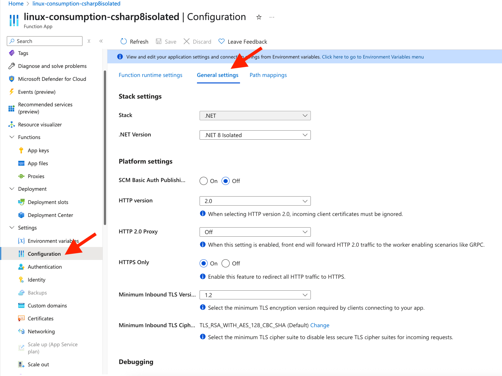

4. Check for storage mounts under the `Path mappings` tab:
   - Note any file share mounts that your app depends on
   - Document the storage account, share name, mount path, and access type

5. Go to `Scale out` under the `Settings` section
   - Check if `Enforce Scale Out Limit` is enabled, and if so take note of the `Maximum Scale Out Limit` value.

5. Check for any custom domains:
   - Go to `Custom domains` under the `Settings` section
   - Document any custom domain names and their SSL bindings

6. Check for CORS settings:
   - Go to `CORS` under the `API` section
   - Document allowed origins and any other CORS settings

Take note of any of these configurations and decide if you need the same on the destination Flex Consumption app.

## Pre-migration tasks - Identity based role access

Before migrating, you should document any managed identities (system-assigned or user-assigned) and their associated role-based access control (RBAC) permissions from your Linux Consumption app. These identities and permissions will need to be recreated for your new Flex Consumption app.

### Using Azure CLI

1. Check if the function app has a system-assigned identity:

   ```bash
   az functionapp identity show --name <FunctionAppName> --resource-group <ResourceGroupName> --query "{principalId:principalId, tenantId:tenantId}" -o table 
   ```

   If the command returns a principal ID and tenant ID, the function app has a system-assigned identity enabled.

2. Check if the function app has any user-assigned identities:

   ```bash
   az functionapp identity show --name <FunctionAppName> --resource-group <ResourceGroupName> --query userAssignedIdentities
   ```

   Take note of any user-assigned identities associated with the function app.

3. If either type of identity is found, list the role assignments for each those identities using the principalId:

   ```bash
   az role assignment list --assignee <PrincipalID> --all
   ```

   For user-assigned identities, repeat this process for each identity's principal ID.

Take note of all identities and their role assignments, as you'll need to recreate these for your new Flex Consumption app.

### Using Azure Portal

1. Navigate to your function app in the Azure Portal
2. In the left menu, find and click on `Identity` under the `Settings` section
3. Check the `System assigned` tab to see if a system-assigned identity is enabled
   - If enabled, click on `Azure role assignments` to view what access this identity has.

   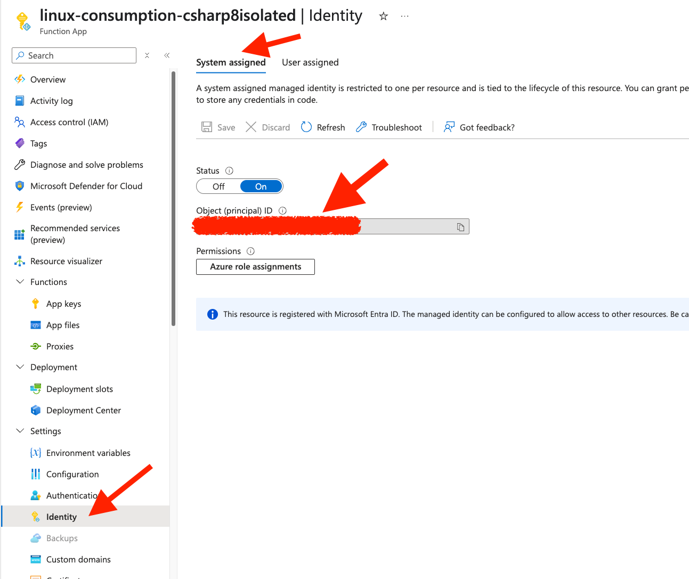
   *Image Description*: A screenshot showing the system-assigned identity configuration in the Azure Portal.

4. Check the `User assigned` tab to see if any user-assigned identities are assigned.
   - Note the names of any user-assigned identities.
   - For each user-assigned identity, you'll need to check its role assignments separately

   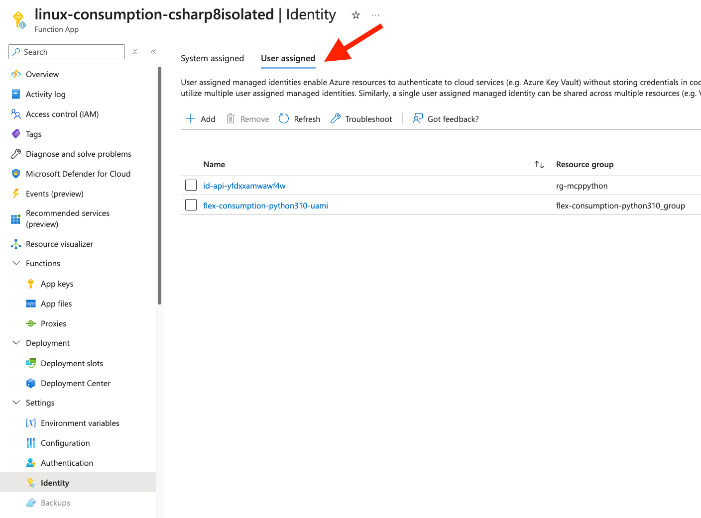
   *Image Description*: A screenshot showing the user-assigned identity configuration in the Azure Portal.

5. For each user-assigned identity, navigate to that managed identity resource and check its `Azure role assignments`

Document all identities and their role assignments so that you can recreate the same permissions structure for your new Flex Consumption app.

> **Note:** When migrating to Flex Consumption, you cannot transfer system-assigned identities directly. You'll need to enable system-assigned identity and then recreate the role assignments for it. For user-assigned identities you can associate the same user-assigned identities to your new function app. This is a critical step to ensure your function app has the same access to Azure resources after migration.

## Pre-migration tasks - Built-in authentication, app and function keys

Before migrating to Flex Consumption, you should collect information about your function app's authentication configuration and the keys used for securing HTTP-triggered functions. These settings cannot be automatically transferred and must be manually recreated in your new Flex Consumption app. This is an optional step if you require the new function app to have the same exact keys and authentication as the old one. If so, you can recreate the host keys, function-specific keys, and authentication settings.

### Using Azure CLI

1. Check if [built-in authentication](https://learn.microsoft.com/en-us/azure/app-service/overview-authentication-authorization) is configured for your function app:

   ```bash
   az webapp auth show --name <FunctionAppName> --resource-group <ResourceGroupName>
   ```

   Review the output to determine if authentication is enabled and which identity providers are configured.

2. List the host keys (also known as admin keys) for your function app:

   ```bash
   az functionapp keys list --name <FunctionAppName> --resource-group <ResourceGroupName> 
   ```

   This will retrieve all the function app keys, including host keys and system keys. Host keys control access to all functions within the app, while system keys are used for extension functionality.

3. List function-specific keys for each function in your app:

  First, get a list of all functions in the app:
  ```bash
  # Get list of all functions in the app
  az functionapp function list --name <FunctionAppName> --resource-group <ResourceGroupName>  --query "[].config.name" -o tsv
  ```

4. Then, for each function name returned by the previous command, get its keys:
  ```bash
  # Get keys for a specific function (run this for each function name)
  az functionapp function keys list --function-name <FunctionName> --name <FunctionAppName> --resource-group <ResourceGroupName>
  ```

Take note of these keys and authentication settings, as you can choose to recreate them in your new Flex Consumption app.

### Using Azure Portal

1. Check if built-in authentication is configured:
   - Navigate to your function app in the Azure Portal
   - In the left menu, under the `Settings` section, click on `Authentication`
   - Document if authentication is enabled and which identity providers are configured (Microsoft, Google, Facebook, Twitter, etc.)
   - Note any advanced settings like token store, allowed external redirects, and allowed token audiences

2. Collect host keys and system keys:
   - In the left menu, under the `Functions` section, click on `App keys`
   - Document all the host keys (default and any custom keys) and system keys
   
3. Collect function-specific keys:
   - In the left menu, click on `Overview`
   - For each function in the list in the `Functions` section, click on the function name
   - Click on `Function Keys` in the function's menu
   - Document all keys for each function

> **Important:** These keys are used by clients that call your function app. If clients use these keys (in URLs or headers), you'll need to either recreate the same keys in your new function app or update the clients to use the new keys. Keys cannot be directly transferred between function apps.

> **Security Note:** Function keys and host keys are sensitive security information. Store them securely and avoid including them in source control or sharing them unnecessarily. Consider using a secure secret store like Azure Key Vault for temporary storage during migration.

> **Authentication Tip:** If your function app uses built-in authentication, you'll need to reconfigure it completely in the new Flex Consumption app. Pay special attention to redirect URIs, allowed external redirects, and token settings to ensure a smooth transition for authenticated users.

## Pre-migration tasks - Networking access restrictions

Before migrating to Flex Consumption, you should document any inbound access restrictions configured on your Linux Consumption function app. These restrictions will need to be recreated on your new Flex Consumption app.

### Using Azure CLI

1. Check if the function app has any IP-based access restrictions:

   ```bash
   az functionapp config access-restriction show --name <FunctionAppName> --resource-group <ResourceGroupName>
   ```

   This command will return a list of any IP-based access restrictions configured for your function app. Take note of:
   - IP addresses or CIDR ranges
   - Priority values
   - Action type (Allow/Deny)
   - Names of the rules

2. Document these restrictions, as you'll need to recreate them on your new Flex Consumption app after migration.

### Using Azure Portal

1. Navigate to your function app in the Azure Portal
2. In the left menu, find and click on `Networking` under the `Settings` section
3. If you see `Enabled with no access restrictions` under `Public network access` then there is no inbound access restrictions. Otherwise click on `Access restrictions`
4. Document all IP-based access restrictions configured here, including:
   - IP addresses or CIDR ranges
   - Priority values
   - Action type (Allow/Deny)
   - Names of the rules

> **Note:** Only IP-based access restrictions apply to Linux Consumption apps. When migrating to Flex Consumption, you will have additional networking capabilities such as Virtual Network integration and inbound private endpoints, which you might want to implement for enhanced security.

## Pre-migration tasks - app code or zip file

If your app is deployed from a local zip file or from source control, ensure you have access to it. If you no longer have access to it, you can still get the zip file. There are two options for this:
  * If the app has the `WEBSITE_RUN_FROM_PACKAGE` app setting set to a URL endpoint, the package is stored externally and managed by you directly on that endpoint.
  * If the `WEBSITE_RUN_FROM_PACKAGE` app setting is not set, then the content will be in the `scm-releases` folder of the storage account associated with the function app via the `AzureWebJobsStorage` app setting

### Using Azure CLI

1. Identify the application code deployment method, first checking if the `WEBSITE_RUN_FROM_PACKAGE` app setting is present:

    ```bash
    az functionapp config appsettings list --name <FunctionAppName> --resource-group <ResourceGroupName> --query "[?name=='WEBSITE_RUN_FROM_PACKAGE'].value" -o tsv
    ```

2. If the previous command returns a URL, then download the zip file from that URL location that is owned by you.

3. If the command in step 1 returns empty or is set to "1", we need to retrieve the package from the Azure storage account associated with the function app:

    ```bash
    az functionapp config appsettings list --name <FunctionAppName> --resource-group <ResourceGroupName> --query "[?name=='AzureWebJobsStorage' || name=='AzureWebJobsStorage__accountName'].value" -o tsv
    ```

3. Take note of the value for accountName in the result of the previous call. This is the name of the storage account associated with the function app. Now list the files from the `scm-releases` folder:

    ```bash
    az storage blob list --account-name <StorageAccountName> --container-name scm-releases --auth-mode login --query "[].name" -o tsv
    ```

4. The zip file name should look like `scm-latest-<FunctionAppName>.zip`. Now download the zip file:

    ```bash
    az storage blob download --account-name <StorageAccountName> --container-name scm-releases --name <ZipFileName>
    ```

    > **Note:** The zip file will have been zipped using the squashfs format. If you want to see what's inside the file, you'll need to use tools that understand that format.

### Using Azure Portal

1. In the Azure portal, go to your function app and under Environment Variables check if the `WEBSITE_RUN_FROM_PACKAGE` app setting exists.
2. If `WEBSITE_RUN_FROM_PACKAGE` exists, check if it's set to 1 or a URL. If set to a URL, that is the URL of where the zip file for your app content. Download the zip file from that URL location that is owned by you.
3. If `WEBSITE_RUN_FROM_PACKAGE` is missing or set to 1, then you will need to download it from the associated storage account. Check for the `AzureWebJobsStorage` or `AzureWebJobsStorage__accountName` application setting, and find the accountName. That is the name of the storage account.
4. In the Azure Portal, find the storage account with that name. 
5. Go to "Containers" and look for the "scm-releases" container
6. The latest deployment package should be named like `scm-latest-<functionappname>.zip`
7. Download this zip file for later use

> **Note:** The zip file will have been zipped using the squashfs format. If you want to see what's inside the file, you'll need to use tools that understand that format.

## Migration Steps

Before proceeding with the actual migration, this is an excellent time to pause and thoroughly review all the information you've gathered about your Linux Consumption function app. Consider the following:

1. **Review all collected information**: Go through all the notes, configuration details, and application settings you've documented in the previous assessment and pre-migration sections.

2. **One final verification in the Azure Portal**: Take a final pass through your function app in the Azure Portal to ensure you haven't missed any important settings or configurations that might be relevant to your application's functionality.

3. **Migration plan**: Based on your findings, create a simple checklist or plan for your migration, including:
   - Any settings that need special attention
   - Dependencies that might be affected during migration
   - Testing strategy for post-migration validation
   - Rollback plan in case of unexpected issues

4. **Downtime planning**: Consider if and when you'll need to stop the original function app to avoid duplicate processing of events, and how this might impact your users or downstream systems.

This careful review will help ensure a smoother migration process and minimize the risk of overlooking important configurations.

### Step 1: Create a new Flex Consumption app

- For detailed instructions on creating a Flex Consumption app using the Azure CLI, Azure portal, or Visual Studio Code, see [Create a Flex Consumption app](https://learn.microsoft.com/en-us/azure/azure-functions/flex-consumption-how-to#create-a-flex-consumption-app).
- refer to the Azure Functions Flex Consumption samples for creating Flex Consumption apps using [ARM](https://github.com/Azure-Samples/azure-functions-flex-consumption-samples/tree/main/IaC/armtemplate), [Bicep](https://github.com/Azure-Samples/azure-functions-flex-consumption-samples/tree/main/IaC/bicep), or [Terraform](https://github.com/Azure-Samples/azure-functions-flex-consumption-samples/tree/main/IaC/terraform).

When creating your new Flex Consumption app, consider using managed identities instead of connection strings for authenticating with Azure Storage and other Azure services. This improves security by eliminating the need to store credentials in your application settings and is a recommended best practice, especially if your original Linux Consumption app wasn't yet using this capability. For detailed guidance on implementing identity-based connections, see [Tutorial: Create a function app that connects to Azure services using identities instead of secrets](https://learn.microsoft.com/en-us/azure/azure-functions/functions-identity-based-connections-tutorial).

### Step 2: Apply App Settings to the New Flex Consumption App

Before deploying your code, you need to configure the new Flex Consumption app with the relevant app settings from your original function app.

> **IMPORTANT**: There is [a list of app settings](https://learn.microsoft.com/en-us/azure/azure-functions/functions-app-settings#flex-consumption-plan-deprecations) that don't apply to Flex Consumption and should not be migrated. Please review [the full list](https://learn.microsoft.com/en-us/azure/azure-functions/functions-app-settings#flex-consumption-plan-deprecations) before continuing.

#### Using Azure CLI

```bash
# Get the app settings
app_settings=$(az functionapp config appsettings list --name <FunctionAppName> --resource-group <ResourceGroupName>)

# Filter out settings that don't apply to Flex Consumption apps or that will already have been created
filtered_settings=$(echo "$app_settings" | jq 'map(select(
  (.name | ascii_downcase) != "website_use_placeholder_dotnetisolated" and
  (.name | ascii_downcase | startswith("azurewebjobsstorage") | not) and
  (.name | ascii_downcase) != "website_mount_enabled" and
  (.name | ascii_downcase) != "enable_oryx_build" and
  (.name | ascii_downcase) != "functions_extension_version" and
  (.name | ascii_downcase) != "functions_worker_runtime" and
  (.name | ascii_downcase) != "functions_worker_runtime_version" and
  (.name | ascii_downcase) != "functions_max_http_concurrency" and
  (.name | ascii_downcase) != "functions_worker_process_count" and
  (.name | ascii_downcase) != "functions_worker_dynamic_concurrency_enabled" and
  (.name | ascii_downcase) != "scm_do_build_during_deployment" and
  (.name | ascii_downcase) != "website_contentazurefileconnectionstring" and
  (.name | ascii_downcase) != "website_contentovervnet" and
  (.name | ascii_downcase) != "website_contentshare" and
  (.name | ascii_downcase) != "website_dns_server" and
  (.name | ascii_downcase) != "website_max_dynamic_application_scale_out" and
  (.name | ascii_downcase) != "website_node_default_version" and
  (.name | ascii_downcase) != "website_run_from_package" and
  (.name | ascii_downcase) != "website_skip_contentshare_validation" and
  (.name | ascii_downcase) != "website_vnet_route_all" and
  (.name | ascii_downcase) != "applicationinsights_connection_string"
))')

# Save filtered settings to a JSON file
echo "$filtered_settings" > app_settings_filtered.json

# Apply settings to the new app
az functionapp config appsettings set --name <NewFunctionAppName> --resource-group <ResourceGroupName> --settings @app_settings_filtered.json

# Delete temporary app settings file
rm -rf app_settings_filtered.json

```

#### Using Azure Portal

To transfer settings using the Azure Portal:
- Navigate to your new Flex Consumption function app in the Azure Portal
- Under `Settings`, click on `Environment variables`
- On the `App settings` tab click on `+ Add` for each app setting you want to add from the Linux Consumption app, but skip all the deprecated settings listed [here](https://learn.microsoft.com/en-us/azure/azure-functions/functions-app-settings#flex-consumption-plan-deprecations)
- After adding all relevant settings, click `Apply`

> **Note:** Some settings like connection strings and keys may need to be updated if you're also creating new dependent resources. Review each setting carefully.

### Step 3: Configure General App Settings

Apply the general configuration settings you documented during pre-migration.

#### Using Azure CLI

  ```bash
  # Apply HTTP version setting, TLS settings
  az functionapp config set --name <NewFunctionAppName> --resource-group <ResourceGroupName> \
    --http20-enabled <YourHTTP20Setting> \
    --min-tls-version <YourMinTLSVersion> \

  #Apply the HTTPS Only setting
  az functionapp update --name <NewFunctionAppName> --resource-group <ResourceGroupName> --set HttpsOnly=<YourHTTPSOnlySetting>

  #Apply incoming client cert settings
  az functionapp update --name <NewFunctionAppName> --resource-group <ResourceGroupName> --set clientCertEnabled=<YourClientCertEnabled>
  
  az functionapp update --name <NewFunctionAppName> --resource-group <ResourceGroupName> --set    clientCertMode=<YourClientCertMode>

  az functionapp update --name <NewFunctionAppName> --resource-group <ResourceGroupName> --set    clientCertExclusionPaths=<YourClientCertMode>

  #Apply the SCM Basic Auth Publishing Credentials configuration
   az resource update --resource-group <ResourceGroupName> --name scm --namespace Microsoft.Web --resource-type basicPublishingCredentialsPolicies --parent sites/<FunctionAppName> --set properties.allow=<basicPublishingCredentialsPoliciesSetting>
  ```

#### Using Azure Portal

1. Navigate to your new Flex Consumption function app in the Azure Portal
2. Under `Settings`, click on `Configuration`
3. Click on the `General settings` tab
4. Update the settings to match what you documented from your Linux Consumption app:
  - SCM Basic Auth Publishing Credentials
  - HTTP version
  - HTTPS Only
  - Minimum Inbound TLS Version and cypher
  - Client Certificate settings
5. Click "Save" to apply the changes

### Step 4: Configure Scale and Concurrency Settings

> **Important Note:** Unlike Linux Consumption, Flex Consumption implements [per-function scaling](https://learn.microsoft.com/en-us/azure/azure-functions/flex-consumption-plan#per-function-scaling), where each function within your app can scale independently based on its workload. Scaling is also more strictly related to [concurrency settings](https://learn.microsoft.com/en-us/azure/azure-functions/flex-consumption-plan#concurrency), where the platform makes scaling decisions based on the current concurrent executions. Carefully evaluate the concurrency settings first if you want your Flex Consumption app to scale similarly to your Linux Consumption app. Higher concurrency values may result in fewer instances being created to handle the same load.

If you had a custom scale-out limit in your Linux Consumption app, apply it to your Flex Consumption app.

#### Using Azure CLI

```bash
# Set the maximum instance count. Note that the lowest number this can be set to is 40.
az functionapp scale config set --name <NewFunctionAppName> --resource-group <ResourceGroupName> \
--maximum-instance-count<YourMaxScaleOutValue>
```

#### Using Azure Portal

1. Navigate to your new Flex Consumption function app in the Azure Portal
2. Under `Settings`, click on `Scale and concurrency`
3. In `Maximum instance count`, set a maximum value that the app should be allowed to scale out to. Note that the lowest number this can be set to is 40.
4. Click `Save` to apply the changes

### Step 5: Configure Storage Mounts

If your Linux Consumption app used storage mounts, recreate them in your Flex Consumption app.

#### Using Azure CLI

```bash
# For each storage mount you documented
az webapp config storage-account add --resource-group <ResourceGroupName> --name <NewFunctionAppName> \
  --custom-id <MountName> \
  --storage-type <AzureBlob or AzureFiles> \
  --account-name <StorageAccountName> \
  --share-name <ShareName> \
  --access-key <AccessKey> \
  --mount-path <MountPath>
```

#### Using Azure Portal

1. Navigate to your new Flex Consumption function app in the Azure Portal
2. Under `Settings`, click on `Configuration`
3. Click on the `Path mappings` tab
4. Click `+ New Azure Storage Mount` for each storage mount you need to recreate
5. Enter the details you documented during pre-migration
6. Click `OK` and then `Save`

### Step 6: Configure Custom Domains and CORS

If your Linux Consumption app used custom domains or CORS settings, apply them to your Flex Consumption app.

#### Using Azure CLI

```bash
# For each custom domain
az functionapp config hostname add --name <NewFunctionAppName> --resource-group <ResourceGroupName> --hostname <CustomDomain>

# For CORS settings
az functionapp cors add --name <NewFunctionAppName> --resource-group <ResourceGroupName> --allowed-origins <AllowedOrigins>
```

#### Using Azure Portal

For custom domains:
1. Navigate to your new Flex Consumption function app in the Azure Portal
2. Under `Settings`, click on `Custom domains`
3. Follow the wizard to add each custom domain

For CORS settings:
1. Navigate to your new Flex Consumption function app in the Azure Portal
2. Under `API`, click on `CORS`
3. Add each allowed origin you documented
4. Click `Save`

### Step 7: Configure Identity and RBAC

Recreate the identity configurations and role assignments you documented during pre-migration.

#### Why Recreate Role Assignments?
- **System-Assigned Identities**: These cannot be transferred directly. You must enable a new system-assigned identity on the Flex Consumption app and recreate its role assignments.
- **User-Assigned Identities**: These can be reassigned to the new app, but you must verify that the role assignments are correct to access the Azure Functions dependencies and create the appropriate role assignments manually.

#### Using Azure CLI

```bash
# Enable system-assigned identity
az functionapp identity assign --name <NewFunctionAppName> --resource-group <ResourceGroupName>

# Get the principal ID of the new system-assigned identity
new_principal_id=$(az functionapp identity show --name <NewFunctionAppName> --resource-group <ResourceGroupName> --query principalId -o tsv)

# Assign roles (repeat for each role)
az role assignment create --assignee $new_principal_id --role <RoleName> --scope <ResourceScope>

# For user-assigned identities, assign them to the app. The role-based access should already be set.
az functionapp identity assign --name <NewFunctionAppName> --resource-group <ResourceGroupName> \
  --identities "/subscriptions/<SubscriptionId>/resourcegroups/<ResourceGroupName>/providers/Microsoft.ManagedIdentity/userAssignedIdentities/<IdentityName>"
```

#### Using Azure Portal

1. Navigate to your new Flex Consumption function app in the Azure Portal.
2. Under `Settings`, click on `Identity`.
3. For system-assigned identity:
   - Enable the system-assigned identity.
   - Click `Azure role assignments` and add each role you documented.
4. For user-assigned identities:
   - Switch to the `User assigned` tab.
   - Click `+ Add` and select each identity you documented.

> **Note**: Recreating role assignments is critical to ensure your function app has the same access to Azure resources after migration.

### Step 8: Configure Authentication

If your Linux Consumption app used built-in authentication, recreate it in your Flex Consumption app.

#### Using Azure CLI

Review [the `az webapp auth update` command](https://learn.microsoft.com/en-us/cli/azure/webapp/auth?view=azure-cli-latest#az-webapp-auth-update) and, based on the auth that was configured for the Linux Consumption app, use it to create the same configuration.

#### Using Azure Portal

1. Navigate to your new Flex Consumption function app in the Azure Portal
2. Under `Settings", click on `Authentication`
3. Click `Add identity provider`
4. Select the same identity provider(s) you used in your Linux Consumption app
5. Configure each provider with the settings you documented
6. Click `Add`

### Step 9: Configure Function Keys

This is an optional step if you require the new function app to have the same exact keys as the old one. If so, you can recreate the host keys and function-specific keys.

#### Using Azure CLI

```bash
# For host keys
az functionapp keys set --name <NewFunctionAppName> --resource-group <ResourceGroupName> \
  --key-name <KeyName> --key-value <KeyValue>

# For function-specific keys (repeat for each function)
az functionapp function keys set --name <NewFunctionAppName> --resource-group <ResourceGroupName> \
  --function-name <FunctionName> --key-name <KeyName> --key-value <KeyValue>
```

#### Using Azure Portal

1. Navigate to your new Flex Consumption function app in the Azure Portal
2. For host keys:
   - Under "Functions", click on "App keys"
   - Click "+ New host key" for each host key you need to recreate
   - Enter the key name and value from your original app
3. For function keys (after deploying your code):
   - Click on the function name
   - Click on "Function Keys" 
   - Click "+ New function key" for each function key
   - Enter the key name and value

### Step 10: Configure Network Access Restrictions

Apply any IP-based access restrictions you documented.

#### Using Azure CLI

```bash
# For each IP restriction rule
az functionapp config access-restriction add --name <NewFunctionAppName> --resource-group <ResourceGroupName> \
  --rule-name <RuleName> --action Allow --ip-address <IPAddress> --priority <Priority>
```

#### Using Azure Portal

1. Navigate to your new Flex Consumption function app in the Azure Portal
2. Under "Settings", click on "Networking"
3. Click on "Access restrictions"
4. Click "+ Add rule" for each access restriction you documented
5. Enter the details for each rule
6. Click "Add"

### Step 11: Deployment Considerations by Trigger Type

#### HTTP Triggered Functions
- **Low Risk**: HTTP triggers are the easiest to migrate as they don't involve message queues or event streams
- **Strategy**: 
  1. Deploy to the new Flex Consumption app
  2. Validate functionality with test requests
  3. Update DNS or client configuration to point to the new app (if using custom domains)
  4. Consider implementing a temporary redirect from the old app to the new one for any clients still using the old endpoint

#### Queue and Service Bus Triggers
- **Higher Risk**: These process messages that might be lost if not handled correctly
- **Strategy**:
  1. **Option A - Dual Processing with Existing Queue**:
     - Ensure messages are using [peek-lock mode](https://learn.microsoft.com/en-us/azure/azure-functions/functions-bindings-service-bus-trigger?tabs=in-process%2Cextensionv5&pivots=programming-language-csharp#peeklock-behavior) (default for Service Bus)
     - Consider temporarily scaling out the original app to process any existing backlog
     - Deploy to the new Flex Consumption app
     - For Queue Storage: Implement a [poison message handling strategy](https://learn.microsoft.com/en-us/azure/azure-functions/functions-bindings-storage-queue-output?tabs=in-process%2Cextensionv5#poison-messages)
     - For Service Bus: Use [dead-letter queues](https://learn.microsoft.com/en-us/azure/service-bus-messaging/service-bus-dead-letter-queues) to capture any failed processing
     - Stop the original app after ensuring no critical messages remain in the queue
  
  2. **Option B - Create New Queue/Topic (Recommended)**:
     - Create a new queue or topic for the Flex Consumption app
     - Update message senders/clients to direct new messages to the new queue/topic
     - Configure the new Flex Consumption app to process from the new queue/topic
     - Allow the original app to drain the existing queue/topic
     - Once the old queue is empty, stop the original app
     - This approach provides a clean cutover with minimal risk of message loss or duplication

#### Event Hub and Event Grid Triggers
- **Medium Risk**: These typically use checkpoints to track processing position
- **Strategy**:
  1. For Event Hub: Consider using [consumer groups](https://learn.microsoft.com/en-us/azure/event-hubs/event-hubs-features#consumer-groups)
     - Create a new consumer group for the Flex Consumption app
     - Configure the new app to use this consumer group 
     - This allows both apps to process events independently during validation
  2. For Event Grid: Consider [temporarily subscribing both apps](https://learn.microsoft.com/en-us/azure/event-grid/create-topic-subscription)
  3. Validate the new Flex Consumption app is processing events correctly
  4. Stop the original app or remove its subscription/consumer group

#### Timer Triggers
- **Low Risk**: These are schedule-based and don't process external messages
- **Strategy**:
  1. Note the schedule of critical timer triggers
  2. Deploy to the new Flex Consumption app
  3. Modify the schedule slightly (offset by a few minutes) to prevent exact simultaneous execution
  4. Validate the new app's timer functions are executing correctly
  5. Stop the original app

#### Blob Storage Triggers
- **Higher Risk**: These can be complex due to scan mechanisms
- **Strategy**:
  1. **Option A - Dual Processing with Existing Container**:
     - Ensure you've migrated from the `LogsAndContainerScan` blob trigger to the [Event Grid-based blob trigger implementation](https://learn.microsoft.com/en-us/azure/azure-functions/functions-event-grid-blob-trigger)
     - Deploy to the new Flex Consumption app
     - Run both apps temporarily to ensure all blobs are processed
     - Stop the original app once processing is verified
  
  2. **Option B - Create New Blob Container (Recommended)**:
     - Create a new blob container for the Flex Consumption app
     - Configure the new Flex Consumption app to trigger on the new container
     - Update blob uploading applications/services to direct new blobs to the new container
     - Allow the original app to process any remaining blobs in the original container
     - Once all existing blobs are processed, stop the original app
     - This approach provides a clean separation with minimal risk of duplicate processing

#### Cosmos DB Change Feed Triggers
- **Higher Risk**: These require careful handling of leases and checkpoints
- **Strategy**:
  1. **Option A - Dual Processing with Lease Containers**:
     - Ensure you're using the [latest Cosmos DB trigger extension](https://learn.microsoft.com/en-us/azure/azure-functions/functions-bindings-cosmosdb-v2)
     - The Cosmos DB change feed trigger uses a lease container to track processing progress
     - Deploy to the new Flex Consumption app
     - Temporarily set a different `leaseCollectionName` or `leaseCollectionPrefix` in the new app trigger attributes
     - This allows the new app to process from the beginning of the change feed without conflicting with the existing app
     - Once the new app catches up, stop the original app
     - Update the lease container configuration back to the original values if needed
  
  2. **Option B - Create a New Lease Container (Recommended)**:
     - Create a new lease container specifically for the Flex Consumption app
     - Configure the new app to use this dedicated lease container by setting the `leaseCollectionName` property in your function configuration
     - Deploy to the new Flex Consumption app
     - The new app will start processing from the current point in the change feed
     - Validate proper processing in the new app
     - Stop the original app once validation is complete
     - This approach provides better isolation and minimizes risks during migration
  
  3. **Special Considerations**:
     - Be aware of the [`StartFromBeginning`](https://learn.microsoft.com/en-us/azure/azure-functions/functions-bindings-cosmosdb-v2-trigger?tabs=in-process%2Cfunctionsv2&pivots=programming-language-csharp#configuration) property:
       - If set to `true`, the function will process all items in the change feed history
       - If set to `false` (default), it will only process new changes from the time the function starts
     - For migration purposes, you may want to set it to `false` to avoid reprocessing historical data
     - Review the [`LeaseCollectionPrefix`](https://learn.microsoft.com/en-us/azure/azure-functions/functions-bindings-cosmosdb-v2-trigger?tabs=in-process%2Cfunctionsv2&pivots=programming-language-csharp#configuration) if you have multiple functions reading from the same container
     - Consider temporarily increasing [`MaxItemsPerInvocation`](https://learn.microsoft.com/en-us/azure/azure-functions/functions-bindings-cosmosdb-v2-trigger?tabs=in-process%2Cfunctionsv2&pivots=programming-language-csharp#configuration) in the new app to help it catch up faster

### General Data Preservation Strategies

1. **Implement Idempotency**: Ensure your functions can safely process the same message multiple times without negative side effects
2. **Logging and Monitoring**: Enable detailed logging in both apps during migration to track message processing
3. **Checkpointing**: For streaming triggers, ensure proper checkpointing is implemented to track processing position
4. **Temporary Parallel Processing**: Run both apps in parallel temporarily with careful monitoring for validation
5. **Gradual Cutover**: For high-volume systems, consider a gradual cutover by redirecting portions of traffic to the new app

### Step 12: Publish Your App Code to the New Flex Consumption App

Now that your Flex Consumption app is configured, it's time to deploy your code. This step requires careful planning based on your trigger types to ensure a smooth transition without data loss.

#### Using the CLI

1. **Deploy Using a Local Zip File**:
   Use the following Azure CLI command to deploy your function app code from a local zip file:
   ```bash
   az functionapp deployment source config-zip --resource-group <ResourceGroupName> --name <NewFunctionAppName> --src /path/to/function/package.zip
   ```

To stop the original app if needed:
```bash
az functionapp stop --name <OriginalFunctionAppName> --resource-group <ResourceGroupName>
```

#### Using Azure Portal and CI/CD

1. Navigate to your new function app in the Azure Portal
2. Under the "Deployment" section, click on "Deployment Center"
3. Choose your deployment method:
   - GitHub
   - Azure Repos
4. Follow the wizard to configure your deployment option
5. Complete the deployment by following the portal prompts

If you need to stop the original app:
1. Navigate to your original Linux Consumption function app
2. Click "Stop" at the top of the Overview page

> **⚠️ Warning**: Once deployed, the new Flex Consumption app will immediately start processing events from triggers (such as Service Bus, Event Hub, or Storage Queue). This means both your original Linux Consumption app and the new Flex Consumption app may compete for the same events, potentially resulting in duplicate processing. Please review [Step 11](#step-11-deployment-considerations-by-trigger-type) for further guidance.

## Validation

### Verify Basic Functionality

1. Verify the Function App is running on the Flex Consumption plan:

   ```bash
   az functionapp show --name <FunctionAppName> --resource-group <ResourceGroupName> --query "serverFarmId"
   ```

2. Make sure Application Insights is configured for your function app, then monitor function execution through Application Insights in the Azure Portal through the Application Insights resource or use the App Insights query API.

### Comprehensive Monitoring Strategy

After migrating to Flex Consumption, implement a structured monitoring approach to ensure optimal performance and detect any issues. The following metrics are specifically available for Flex Consumption apps:

#### Using Azure CLI

```bash
# First, get the resource ID of your Flex Consumption function app (required for metrics commands)
ResourceId=$(az functionapp show --name <FunctionAppName> --resource-group <ResourceGroupName> --query id -o tsv)
echo "Function App Resource ID: $ResourceId"

# Monitor Always Ready and On Demand execution counts
az monitor metrics list --resource $ResourceId --metric "AlwaysReadyFunctionExecutionCount" --interval PT1H --output table
az monitor metrics list --resource $ResourceId --metric "OnDemandFunctionExecutionCount" --interval PT1H --output table

# Monitor execution units (MB-milliseconds) in Always Ready and On Demand instances
az monitor metrics list --resource $ResourceId --metric "AlwaysReadyFunctionExecutionUnits" --interval PT1H --output table
az monitor metrics list --resource $ResourceId --metric "OnDemandFunctionExecutionUnits" --interval PT1H --output table

# Monitor Always Ready resource utilization
az monitor metrics list --resource $ResourceId --metric "AlwaysReadyUnits" --interval PT1H --output table

# Monitor memory utilization
az monitor metrics list --resource <ResourceId> --metric "AverageMemoryWorkingSet" --interval PT1H --output table
az monitor metrics list --resource <ResourceId> --metric "MemoryWorkingSet" --interval PT1H --output table

# Monitor instance count and CPU utilization
az monitor metrics list --resource <ResourceId> --metric "InstanceCount" --interval PT1H --output table
az monitor metrics list --resource <ResourceId> --metric "CpuPercentage" --interval PT1H --output table
```

> **Note**: Flex Consumption metrics are different from Linux Consumption metrics. When comparing performance before and after migration, keep in mind that you'll need to use different metrics to track similar performance characteristics.

#### Using Azure Portal

1. **Function App Metrics**:
   - Navigate to your Flex Consumption function app in Azure Portal
   - Go to "Metrics" under the "Monitoring" section
   - Click "Add metric" and explore the available metrics:
     - **Always Ready metrics**: Always Ready Function Execution Count, Always Ready Function Execution Units, Always Ready Units
     - **On Demand metrics**: On Demand Function Execution Count, On Demand Function Execution Units
     - **Memory metrics**: Average Memory Working Set, Memory Working Set
     - **Performance metrics**: Instance Count, Cpu Percentage
   - Create custom charts combining related metrics for better visibility
   - Use "Add filter" to focus on specific functions or dimensions

2. **Custom Monitoring Dashboards**:
   - Create a dedicated dashboard for monitoring your Flex Consumption app
   - Add multiple metric charts to track different aspects of performance
   - Include both Always Ready and On Demand metrics for complete visibility
   - Set up alerts for key metrics that exceed expected thresholds

3. **Application Insights Integration (Recommended)**:
   - While platform metrics provide infrastructure-level insights, Application Insights gives you code-level visibility
   - If not already enabled, add Application Insights to your function app
   - Within Application Insights, you can:
     - Track detailed execution times and dependencies
     - Monitor individual function performance
     - Analyze failures and exceptions
     - Create custom queries to correlate platform metrics with application behavior
   - Use "Performance" to analyze response times and dependencies
   - Use "Failures" to identify any errors occurring after migration
   - Create custom queries in "Logs" to analyze function behavior:

     ```kusto
     // Compare success rates by instance
     requests
     | where timestamp > ago(7d)
     | summarize successCount=countif(success == true), failureCount=countif(success == false) by bin(timestamp, 1h), cloud_RoleName
     | render timechart
     ```

### Performance Benchmarking

Conduct structured performance testing to compare the migrated app against your original Linux Consumption app:

1. **Cold Start Comparison**:
   - Measure the time from first request to response after idle periods
   - Test with different memory allocation settings in Flex Consumption

2. **Throughput Testing**:
   - Measure maximum requests per second using [load testing tools](https://learn.microsoft.com/en-us/azure/load-testing/how-to-optimize-azure-functions)
   - Compare how both plans handle concurrent requests

3. **Latency Analysis**:
   - Track the P50, P95, and P99 response times under various load conditions
   - Monitor these metrics in Application Insights:

     ```kusto
     requests
     | where timestamp > ago(1d)
     | summarize percentiles(duration, 50, 95, 99) by bin(timestamp, 1h)
     | render timechart
     ```

### Cost Monitoring

Track cost differences between Linux Consumption and Flex Consumption:

1. **Using Azure Cost Management**:
   - Go to the [`Cost Management + Billing` service](https://learn.microsoft.com/en-us/azure/cost-management-billing) in Azure Portal
   - Filter by resource to compare the cost of both function apps
   - Create cost alerts for unexpected spending

2. **Cost Optimization Opportunities**: 
   - Monitor memory utilization and adjust function memory allocation settings
   - Analyze function execution patterns and adjust concurrency settings
   - Consider using the Always Ready feature selectively for critical functions

By implementing this comprehensive monitoring strategy, you can validate the success of your migration, identify any issues promptly, and optimize the performance and cost of your Flex Consumption function app.

## Troubleshooting and Recovery Strategies

Despite careful planning, migration issues may occur. Here's how to handle different recovery scenarios:

### If the New Flex Consumption App Fails to Start and Function Triggers Aren't Processing Events

1. **Check Logs Immediately**:
   - Check the App Insights associated with the function app for any Failures or extra information in the `traces` table
   - Check `Diagnose and solve problems` for the app and review the `Availability and Performance` detectors like the `Function App Down or Reporting Errors` one.

2. **Review Application Settings**:
   - Verify that all critical application settings were correctly transferred
   - Look for any [deprecated settings](https://learn.microsoft.com/en-us/azure/azure-functions/functions-app-settings#flex-consumption-plan-deprecations) that might have been incorrectly migrated
   - Check for typos or incorrect connection strings

3. **Rollback Plan for Critical Production Apps**:
   - If the original Linux Consumption app was stopped, restart it:
     ```bash
     az functionapp start --name <OriginalFunctionAppName> --resource-group <ResourceGroupName>
     ```
   - If you created new queues/topics/containers, ensure clients are redirected back to the original resources
   - If you modified DNS or custom domains, revert these changes to point to the original app

4. **Verify Binding Configuration**:
   - Check that all binding configurations are correct
   - For Event Hub triggers, verify consumer group settings
   - For queue triggers, verify connection strings and queue names

5. **Monitor Both Apps During Transition**:
   - Use Azure Monitor to compare metrics between the original and new apps
     ```bash
     az monitor metrics list --resource <ResourceId> --metric <MetricName>
     ```
   - Watch for differences in success rates, execution counts, and execution units

6. **Verify identity configurations**
   - Verify and system or user-assigned identities were properly enabled or assigned to the app.
   - Verify that correct roles were assigned to the identities.

### Common Migration Failures and Solutions

| Issue | Solution |
|-------|----------|
| Cold start performance issues | Review concurrency settings, check for missing dependencies |
| Missing bindings | Verify extension bundles, update binding configurations |
| Permission errors | Check identity assignments and role permissions |
| Network connectivity issues | Validate access restrictions and networking settings |
| Missing application insights | Recreate application insights connection |

## Post-migration tasks

### Update Infrastructure as Code and CI/CD Pipelines

### Implement Infrastructure as Code (IaC) and CI/CD Pipelines

To ensure consistency, scalability, and ease of management, it is highly recommended to implement Infrastructure as Code (IaC) and Continuous Integration/Continuous Deployment (CI/CD) pipelines for your Azure Function Apps. Here are the benefits and steps to get started:

#### Benefits of IaC and CI/CD
1. **Consistency**: Define your infrastructure in code to ensure consistent deployments across environments.
2. **Version Control**: Track changes to your infrastructure and application configurations using source control systems like Git.
3. **Automation**: Automate deployments, reducing manual errors and speeding up the release process.
4. **Scalability**: Easily replicate infrastructure for multiple environments (e.g., dev, test, prod).
5. **Disaster Recovery**: Quickly recreate infrastructure in case of failures or migrations.

#### Steps to Implement IaC
- Flex Consumption introduced a new section to the `Microsoft.Web/sites` resource type called `functionAppConfig` where a lot of the app configurations have moved to. 
- Use examples like [ARM template](https://github.com/Azure-Samples/azure-functions-flex-consumption-samples/tree/main/IaC/armtemplate), [Bicep](https://github.com/Azure-Samples/azure-functions-flex-consumption-samples/tree/main/IaC/bicep), or [Terraform](https://github.com/Azure-Samples/azure-functions-flex-consumption-samples/tree/main/IaC/terraform) to define your Flex Consumption function app and associated resources.
- Update your IaC templates to reflect the new Flex Consumption plan configuration.
- Store your IaC templates in a version-controlled repository.

#### Steps to Implement CI/CD
- Use Azure DevOps, GitHub Actions, or other CI/CD tools to automate the deployment of your Function App.
- Update your pipelines to target the new Flex Consumption plan.
- Include steps to validate the deployment, such as running automated tests or health checks.

For more details, refer to the [Continuous delivery by using GitHub Actions](https://learn.microsoft.com/en-us/azure/azure-functions/functions-how-to-github-actions) or [Continuous delivery with Azure Pipelines](https://learn.microsoft.com/en-us/azure/azure-functions/functions-how-to-azure-devops?tabs=csharp%2Cwindows&pivots=v2) and look for Flex Consumption specific notes.

By adopting IaC and CI/CD, you can streamline your migration process and ensure your Function Apps are easier to manage and scale in the future.

### Clean Up (Optional)

After thoroughly testing your new Flex Consumption function app and validating that everything is working as expected, you may want to clean up resources to avoid unnecessary costs. This should only be done once you're completely confident that the migration has been successful and all functionality has been verified over a sufficient period.

We recommend waiting at least a few days or even weeks (depending on your application's usage patterns) to ensure that all scenarios, including infrequent ones, have been properly tested. Once you're satisfied with the migration results, you can proceed with cleaning up the original resources.

#### Using Azure CLI

```bash
# Delete the original Linux Consumption function app
az functionapp delete --name <OriginalFunctionAppName> --resource-group <ResourceGroupName>
```

#### Using Azure Portal

1. Navigate to your original Linux Consumption function app in the Azure Portal
2. Click on "Delete" in the top menu
3. Confirm the deletion by typing the app name
4. Click "Delete" to permanently remove the function app

> **Warning**: This action will delete your original function app but leaves the Consumption plan intact if other apps are using it. Before deleting, ensure you have successfully migrated all functionality to the new Flex Consumption app, verified no traffic is being directed to the original app, and backed up any relevant logs, configuration, or data that might be needed for reference.

## What to expect after migration

After migrating from Linux Consumption to Flex Consumption, you can expect several operational differences:

### Performance Improvements

- **Reduced Cold Start Times**: Flex Consumption when the always ready feature is used typically provides significantly faster cold start times than Linux Consumption.
- **Per-Function Scaling**: Each function within your app scales independently based on its workload, potentially resulting in more efficient resource allocation.
- **Improved Concurrency Handling**: Better handling of concurrent executions with configurable concurrency settings per function.
- **Flexible Memory Configuration**: Flex Consumption offers multiple memory size options (512 MB, 2048 MB, and 4096 MB), allowing you to optimize for your specific workload requirements.
- **Performance vs. Cost Optimization**: By combining memory size configuration with concurrency settings, you can fine-tune your function app's performance characteristics while managing costs effectively. Higher memory sizes may improve performance for memory-intensive operations but at a higher cost per active period.

### Cost Implications

- **Different Billing Models**: 
  - **Flex Consumption**: Charges for instance size memory (512 MB, 2048 MB, or 4096 MB) for the entire period an instance is actively executing functions, regardless of concurrent executions on that instance.
  - **Linux Consumption**: Charges individually for each execution based on observed memory utilization.
- **Optimization Opportunities**: 
  - Adjust concurrency settings to maximize throughput per instance in Flex Consumption.
  - Choose appropriate memory size for your workload - higher memory sizes cost more but may improve performance.

> **Note**: Actual performance improvements and cost implications can vary based on your specific workload patterns and function app configuration. Monitor performance metrics after migration to optimize your configuration.

### Networking Features

- **Enhanced VNet Integration**: Full VNet integration capabilities, allowing access to private endpoints and services.
- **Private Endpoint Support**: Support for private endpoints, enabling private access to your function app.
- **Network Security Group Support**: More granular network security controls than were available with Linux Consumption.

## Conclusion

Congratulations on successfully migrating your Azure function app from Linux Consumption to Flex Consumption! This migration represents a significant improvement in your serverless architecture that will benefit both your users and your organization.

By completing this migration, you've:

- **Enhanced your application performance** with faster cold starts and improved scalability
- **Gained more granular control** over your functions with per-function scaling and concurrency settings
- **Improved your networking capabilities** with better VNet integration and private endpoint support
- **Positioned your application for future growth** on a modern, actively developed hosting platform

Remember to continue monitoring your application in its new environment and fine-tune the settings to optimize cost and performance. The Azure Functions team is continuously evolving the Flex Consumption plan with new features and improvements, so stay informed about new capabilities by regularly checking the [Azure Functions documentation](https://learn.microsoft.com/en-us/azure/azure-functions/).

Thank you for following this migration guide. Your investment in modernizing your Azure Functions will pay dividends in improved performance, scalability, and security for your applications.

Happy coding!